# PostFiat SDK Architecture

This document describes the technical architecture and technology stack of the PostFiat SDK, a modern proto-first multi-language SDK with Python, TypeScript, and Solidity support and AI integration capabilities.

## 🎯 Architecture Overview

The PostFiat SDK is built on a **proto-first, API-driven architecture** that automatically generates type-safe Python, TypeScript, and Solidity code, REST APIs, and AI-powered integrations from Protocol Buffer definitions.

```mermaid
graph TB
    subgraph "Source of Truth"
        A["Protocol Buffers<br/>(.proto files)"]
    end
    
    subgraph "Code Generation Layer"
        B["Buf CLI<br/>Protobuf → Python/TypeScript"]
        C["Custom Generators<br/>Types & Services"]
        D["OpenAPI Generator<br/>REST API Specs"]
        E["Protobuf3-Solidity<br/>Protobuf → Solidity"]
    end
    
    subgraph "Core SDK Layer"
        F["Pydantic Models<br/>Type Safety & Validation"]
        G["SQLModel<br/>Database ORM"]
        H["FastAPI<br/>REST API Server"]
        I["gRPC Services<br/>High Performance RPC"]
        J["Solidity Contracts<br/>Smart Contract Logic"]
    end
    
    subgraph "AI Integration Layer"
        K["PydanticAI<br/>AI Agent Framework"]
        L["LLM Integrations<br/>OpenAI, Anthropic, etc."]
    end
    
    subgraph "Client Layer"
        M["Python SDK<br/>Type-safe Client"]
        N["REST API<br/>HTTP/JSON Interface"]
        O["gRPC Client<br/>Binary Protocol"]
        P["TypeScript SDK<br/>Web Client"]
        Q["Solidity Contracts<br/>EVM Integration"]
    end
    
    A --> B
    A --> C
    A --> D
    A --> E
    B --> F
    C --> F
    C --> G
    E --> J
    F --> H
    F --> I
    F --> K
    G --> H
    K --> L
    F --> M
    H --> N
    I --> O
    F --> P
    J --> Q
```



## 🛠️ Technology Stack

### Protocol Buffers (Proto3)
**Role:** Single source of truth for all data structures and service definitions

**Why Protocol Buffers:**

- **Language agnostic:** Generate code for multiple languages (Python, TypeScript, Solidity)
- **Schema evolution:** Backward/forward compatibility
- **Performance:** Efficient binary serialization
- **Type safety:** Strong typing across all generated code
- **Documentation:** Self-documenting schemas

**Usage:**
```protobuf
syntax = "proto3";
package postfiat.v3;

message ContextualMessage {
  string content = 1;
  MessageType type = 2;
  EncryptionMode encryption = 3;
}

enum MessageType {
  CONTEXTUAL_MESSAGE = 0;
  MULTIPART_MESSAGE_PART = 1;
}

service WalletService {
  rpc CreateWallet(CreateWalletRequest) returns (CreateWalletResponse);
  rpc GetBalance(GetBalanceRequest) returns (GetBalanceResponse);
}
```

### Solidity (Smart Contracts)
**Role:** Blockchain integration and decentralized application logic

**Why Solidity:**

- **EVM compatibility:** Deploy on Ethereum and EVM-compatible chains
- **Proto-first generation:** Automatic contract generation from protobuf definitions
- **Type safety:** Generated contracts maintain protobuf type safety
- **Integration:** Seamless integration with Python and TypeScript SDKs
- **Modern tooling:** Foundry-based build system for optimal performance

**Generated Contracts:**
```solidity
// Auto-generated from protobuf definitions
library Postfiat_V3 {
    struct ContextualMessage {
        string content;
        MessageType message_type;
        EncryptionMode encryption;
    }
    
    enum MessageType {
        CONTEXTUAL_MESSAGE,
        MULTIPART_MESSAGE_PART
    }
    
    enum EncryptionMode {
        NONE,
        NACL_SECRETBOX,
        AES_256_GCM
    }
}
```

**Build System:**
- **Foundry:** Fast, modern Solidity development framework
- **Protobuf3-Solidity:** Automatic contract generation from .proto files
- **Integrated tooling:** Seamless integration with Python and TypeScript workflows

### OpenAPI 3.0
**Role:** REST API specification and documentation generation

**Why OpenAPI:**

- **API-first design:** Design APIs before implementation
- **Auto-documentation:** Interactive API docs with Swagger UI
- **Client generation:** Generate clients for multiple languages
- **Validation:** Request/response validation
- **Tooling ecosystem:** Rich ecosystem of tools and integrations

**Generated from Proto:**

- REST endpoints for each gRPC service method
- JSON schemas for all message types
- Interactive documentation
- Client SDKs for web/mobile

### FastAPI
**Role:** High-performance REST API server framework

**Why FastAPI:**

- **Performance:** One of the fastest Python frameworks
- **Type hints:** Native Python type hint support
- **Auto-validation:** Automatic request/response validation
- **OpenAPI integration:** Built-in OpenAPI/Swagger support
- **Async support:** Native async/await support
- **Developer experience:** Excellent error messages and debugging

**Features:**
```python
from fastapi import FastAPI
from postfiat.models import CreateWalletRequest, CreateWalletResponse

app = FastAPI(title="PostFiat API", version="0.1.0")

@app.post("/wallets", response_model=CreateWalletResponse)
async def create_wallet(request: CreateWalletRequest):
    # Auto-validated input, type-safe output
    return await wallet_service.create_wallet(request)
```

### Pydantic v2
**Role:** Data validation, serialization, and type safety

**Why Pydantic:**

- **Type safety:** Runtime type checking and validation
- **Performance:** Fast validation with Rust core
- **JSON Schema:** Automatic JSON schema generation
- **Serialization:** Flexible serialization/deserialization
- **Integration:** Works seamlessly with FastAPI and SQLModel

**Features:**
```python
from pydantic import BaseModel, Field
from typing import Optional
from datetime import datetime

class WalletModel(BaseModel):
    id: str = Field(..., description="Unique wallet identifier")
    balance: float = Field(ge=0, description="Wallet balance")
    created_at: datetime
    metadata: Optional[dict] = None
    
    class Config:
        json_schema_extra = {
            "example": {
                "id": "wallet_123",
                "balance": 100.50,
                "created_at": "2024-01-01T00:00:00Z"
            }
        }
```

### PydanticAI
**Role:** AI agent framework for intelligent automation

**Why PydanticAI:**

- **Type safety:** Type-safe AI interactions with Pydantic models
- **Multi-LLM:** Support for OpenAI, Anthropic, Google, etc.
- **Structured output:** Guaranteed structured responses
- **Tool integration:** Easy function calling and tool use
- **Validation:** Automatic validation of AI responses

**Features:**
```python
from pydantic_ai import Agent
from postfiat.models import WalletAnalysis, TransactionData

wallet_agent = Agent(
    'openai:gpt-4',
    result_type=WalletAnalysis,
    system_prompt="Analyze wallet transactions and provide insights."
)

async def analyze_wallet(transactions: list[TransactionData]) -> WalletAnalysis:
    result = await wallet_agent.run(
        f"Analyze these {len(transactions)} transactions",
        deps={"transactions": transactions}
    )
    return result.data  # Type-safe WalletAnalysis object
```

### SQLModel
**Role:** Database ORM with type safety and async support

**Why SQLModel:**

- **Type safety:** SQLAlchemy with Pydantic validation
- **Async support:** Native async database operations
- **FastAPI integration:** Seamless integration with FastAPI
- **Migration support:** Alembic integration for schema migrations
- **Performance:** Efficient queries with SQLAlchemy Core

**Features:**
```python
from sqlmodel import SQLModel, Field, create_engine, Session
from typing import Optional

class Wallet(SQLModel, table=True):
    id: Optional[str] = Field(default=None, primary_key=True)
    user_id: str = Field(index=True)
    balance: float = Field(default=0.0, ge=0)
    currency: str = Field(default="USD")
    created_at: datetime = Field(default_factory=datetime.utcnow)

    # Automatic Pydantic validation + SQLAlchemy ORM
```

### Data Model Relationships


### Observability Stack (structlog + loguru)
**Role:** Production-ready observability and structured logging

**Why this dual stack:**

- **structlog:** Structured logging with rich context and JSON output
- **loguru:** Beautiful console output and developer-friendly formatting
- **Integration:** Both work together seamlessly for comprehensive observability
- **Proto-native:** Rich context logging for proto-based operations

**Features:**
```python
from postfiat.logging import get_logger

# Get structured logger
logger = get_logger("api.auth")

# Log with rich context
logger.info(
    "User authentication successful",
    user_id="user_123",
    session_id="sess_456", 
    ip_address="192.168.1.1",
    duration_ms=150,
    request_id="req_789"
)

# Development: Beautiful console output via loguru
# Production: JSON logs with structured context
# {"user_id": "user_123", "request_id": "req_789",
#  "event": "User authentication successful", ...}
```

**Observability Strategy:**

- **Structured logging:** structlog for rich context, loguru for beautiful output
- **Request correlation:** Request IDs and user context tracking
- **Metrics collection:** Proto-native performance and business metrics
- **Behavior boundaries:** Log at factory functions, middleware, utilities
- **Pure data classes:** No logging (enums, simple models)
- **Error tracking:** Integrated with proto-based exception system
- **Request correlation:** Trace IDs + X-Request-ID tracking
- **Proto observability:** gRPC method tracing, proto serialization metrics

## 🏗️ System Components

### Component Relationships


## 🏗️ Architectural Patterns

### Proto-First Development
**Pattern:** All data structures and services defined in Protocol Buffers first

**Benefits:**

- Single source of truth
- Automatic code generation
- Cross-language compatibility
- Schema evolution support

### Layered Architecture
**Layers:**

- **Data Layer:** SQLModel + Database
- **Service Layer:** Business logic and gRPC services
- **API Layer:** FastAPI REST endpoints
- **Client Layer:** Generated SDK clients

### Code Generation Pipeline
**Process:**

- Define schemas in `.proto` files
- Generate Python classes with Buf
- Generate Pydantic models and FastAPI routes
- Generate SQLModel database models
- Generate client SDKs and documentation

### AI-First Integration
**Pattern:** AI capabilities built into core SDK functionality

**Implementation:**

- PydanticAI agents for intelligent automation
- Type-safe AI interactions
- Structured AI responses with validation
- Multi-LLM support for flexibility

## 🔄 Data Flow Architecture

### Request Flow (REST API)


### Request Flow (gRPC)


### AI Integration Flow


## 🚀 Performance Characteristics

### Serialization Performance
- **Protobuf:** ~10x faster than JSON for binary protocols
- **Pydantic v2:** ~5-50x faster validation than v1
- **FastAPI:** Comparable to Node.js and Go frameworks

### Database Performance
- **SQLModel:** Async operations with connection pooling
- **Query optimization:** SQLAlchemy Core for complex queries
- **Caching:** Redis integration for frequently accessed data

### AI Performance
- **Parallel processing:** Concurrent AI agent execution
- **Caching:** Response caching for repeated queries
- **Streaming:** Real-time AI response streaming

## 🔒 Security Architecture

### API Security
- **Authentication:** JWT tokens with FastAPI security
- **Authorization:** Role-based access control (RBAC)
- **Rate limiting:** Request throttling and abuse prevention
- **Input validation:** Comprehensive Pydantic validation

### Data Security
- **Encryption:** At-rest and in-transit encryption
- **SQL injection prevention:** SQLModel parameterized queries
- **Data validation:** Multi-layer validation (Pydantic + Database)

### AI Security
- **Prompt injection protection:** Input sanitization
- **Output validation:** Structured response validation
- **API key management:** Secure credential handling

## 🚀 Deployment Architecture


## 📊 Monitoring and Observability

### Metrics
- **API metrics:** Request/response times, error rates
- **Database metrics:** Query performance, connection pools
- **AI metrics:** Token usage, response times, success rates

### Observability & Logging

**Technology Stack:**

- **[structlog](https://www.structlog.org/):** Structured logging with rich context
- **[loguru](https://loguru.readthedocs.io/):** Beautiful console output and formatting
- **Integration:** Both work together for comprehensive observability

**Implementation:**

- **Structured logging:** JSON logs with correlation IDs and rich context (structlog)
- **Beautiful development:** Human-readable console logs with colors (loguru)
- **Proto-native metrics:** gRPC method performance, serialization metrics
- **Environment-aware:** Console for development, JSON logs for production
- **Request correlation:** Request IDs + X-Request-ID tracking for distributed systems
- **Error tracking:** Comprehensive error reporting with proto-based error codes
- **Audit trails:** User action logging with structured metadata

**Observability Locations:**

- **API Layer:** Request/response logging via FastAPI middleware
- **gRPC Services:** Method logging and performance metrics
- **Exception System:** Factory function logging for error creation and processing
- **Generation Scripts:** Structured logging for build-time observability
- **Pure Data Classes:** No logging (follows best practices)
- **Proto Operations:** Serialization/deserialization performance metrics

### Health Checks
- **Service health:** Database, AI services, external APIs
- **Dependency monitoring:** Real-time dependency status
- **Performance monitoring:** Response time tracking

## 🔮 Future Architecture Considerations

### Scalability
- **Microservices:** Service decomposition as needed
- **Event streaming:** Apache Kafka for event-driven architecture
- **Caching layers:** Redis for performance optimization

### AI Evolution
- **Multi-modal AI:** Support for vision, audio, and text
- **Custom models:** Fine-tuned models for domain-specific tasks
- **Edge AI:** Local AI processing capabilities

### Integration Expansion
- **Blockchain integration:** Web3 and cryptocurrency support
- **Real-time features:** WebSocket support for live updates
- **Mobile SDKs:** Native mobile SDK generation

This architecture provides a solid foundation for building scalable, type-safe, and AI-powered financial applications while maintaining developer productivity and code quality. 🎯
