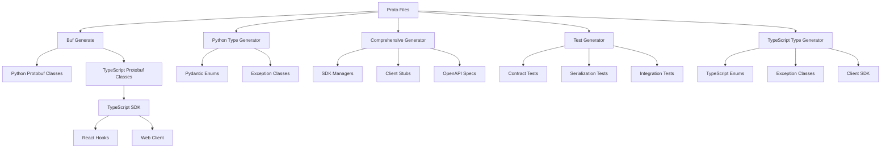

# PostFiat SDK Development Guide

This document describes the code generation architecture and development processes for the PostFiat SDK.

## 🎯 Architecture Overview

The PostFiat SDK follows a **proto-first architecture** where Protocol Buffer definitions are the single source of truth for all generated code across multiple languages and platforms.

### Multi-Language Support

The SDK now supports multiple programming languages with a shared proto definition:

```
pfsdk/
├── proto/                    # Shared protocol buffer definitions
│   ├── buf.gen.yaml         # Multi-language generation config
│   └── postfiat/v3/         # Proto schema definitions
├── python/                   # Python SDK
│   ├── postfiat/            # Python package
│   ├── scripts/             # Python-specific generators
│   └── tests/               # Python test suites
├── typescript/              # TypeScript SDK
│   ├── src/                 # TypeScript source code
│   ├── scripts/             # TypeScript generation scripts
│   └── tests/               # TypeScript test suites
└── docs/                    # Shared documentation
```



## 🔧 Code Generation Pipeline

### 1. Protocol Buffer Generation

**Tool:** [Buf CLI](https://buf.build/)
**Config:** `proto/buf.gen.yaml`
**Command:** `buf generate --template buf.gen.yaml`

**Generates:**
- `python/postfiat/v3/*_pb2.py` - Python message classes
- `python/postfiat/v3/*_pb2_grpc.py` - Python gRPC service stubs
- `typescript/src/generated/*_pb.ts` - TypeScript message classes
- `typescript/src/generated/*_connect.ts` - TypeScript gRPC-Web service stubs

**Example:**
```bash
cd proto
buf generate --template buf.gen.yaml
```

### 2. Python Type Generation

**Script:** `python/scripts/generate_python_types.py`
**Purpose:** Generate Pydantic-compatible types from protobuf enums

**Generates:**
- `python/postfiat/types/enums.py` - Pydantic enum classes
- `python/postfiat/exceptions.py` - SDK exception hierarchy

**Features:**
- Automatic enum extraction from protobuf
- Pydantic compatibility with conversion methods
- Standard exception hierarchy for SDK errors

**Example:**
```python
# Generated enum usage
from postfiat.types.enums import MessageType, EncryptionMode

msg_type = MessageType.CONTEXTUAL_MESSAGE
encryption = EncryptionMode.NACL_SECRETBOX

# Convert to/from protobuf
pb_value = msg_type.to_protobuf()
pydantic_value = MessageType.from_protobuf(pb_value)
```

### 3. TypeScript Type Generation

**Script:** `typescript/scripts/generate-typescript-types.ts`
**Purpose:** Generate TypeScript types and SDK components from protobuf definitions

**Generates:**
- `typescript/src/types/enums.ts` - TypeScript enum classes with conversion utilities
- `typescript/src/types/exceptions.ts` - SDK exception hierarchy
- `typescript/src/client/base.ts` - Base client infrastructure
- `typescript/src/hooks/index.ts` - React hooks for web integration
- `typescript/src/index.ts` - Main SDK export file

**Features:**
- Automatic enum extraction from protobuf
- gRPC-Web client support via Connect-ES
- React hooks for modern web development
- Type-safe error handling
- Conversion utilities between proto and TypeScript types

**Example:**
```typescript
// Generated enum usage
import { MessageType, EncryptionMode } from '@postfiat/sdk';

const msgType = MessageType.CONTEXTUAL_MESSAGE;
const encryption = EncryptionMode.NACL_SECRETBOX;

// Convert to/from protobuf
const pbValue = MessageType.toProtobuf(msgType);
const tsValue = MessageType.fromProtobuf(pbValue);
```

### 4. Comprehensive SDK Generation

**Script:** `python/scripts/generate_protobuf.py`
**Purpose:** Generate complete SDK components from protobuf definitions

**Generates:**
- `python/postfiat/models/envelope_enums.py` - Message envelope enums
- `python/postfiat/managers/` - Service manager classes
- `python/postfiat/services/` - Service implementation stubs
- `python/postfiat/clients/` - Client wrapper classes
- `python/postfiat/integrations/discord/` - Discord command mappers
- `api/` - OpenAPI/Swagger specifications

**Features:**
- Automatic service discovery from protobuf
- Manager pattern for service orchestration
- Client stubs for easy API consumption
- OpenAPI generation for REST endpoints
- Discord integration for command handling

### 5. TypeScript Test Generation

**Script:** `typescript/scripts/generate-typescript-tests.ts`
**Purpose:** Generate comprehensive TypeScript test suites from protobuf definitions

**Generates:**
- `typescript/tests/generated/enums.test.ts` - Enum conversion and validation tests
- `typescript/tests/generated/exceptions.test.ts` - Exception handling tests
- `typescript/tests/generated/client.test.ts` - Client SDK tests
- `typescript/tests/generated/hooks.test.ts` - React hooks tests
- `typescript/tests/generated/integration.test.ts` - Integration test suite

**Features:**
- Jest-based testing framework
- Comprehensive enum testing (conversion, validation, edge cases)
- Exception hierarchy testing
- Client SDK integration testing
- React hooks testing with modern patterns
- Auto-generated test data and scenarios

### 6. Test Generation

**🆕 Dynamic Test Generator (Recommended):**
**Script:** `python/scripts/generate_dynamic_protobuf_tests.py`
**Purpose:** Generate comprehensive test suites using runtime proto introspection

**Generates:**
- `python/tests/generated/test_dynamic_serialization.py` - Round-trip serialization tests
- `python/tests/generated/test_dynamic_validation.py` - Field and enum validation tests
- `python/tests/generated/test_dynamic_services.py` - gRPC service method tests
- `python/tests/generated/test_dynamic_evolution.py` - Schema evolution and compatibility tests

**Key Features:**
- **Runtime Introspection:** Uses actual proto message descriptors (no hardcoded field names)
- **Auto-Adaptation:** Tests automatically adapt when proto schemas change
- **Schema Evolution:** Tests backward compatibility and wire format stability
- **Comprehensive Coverage:** Generates tests for all discovered proto messages

**Test Types:**
- **Serialization Integrity:** Validates round-trip serialization
- **Field Type Validation:** Tests field constraints and types
- **Enum Validation:** Verifies enum values and conversions
- **Service Integration:** Tests service method signatures
- **Schema Evolution:** Tests backward compatibility and field number stability

## 🔄 Development Workflow

### Local Development

1. **Edit Proto Files:**
   ```bash
   # Edit proto/postfiat/v3/*.proto
   vim proto/postfiat/v3/messages.proto
   ```

2. **Generate Code:**
   ```bash
   # Generate protobuf classes
   cd proto && buf generate --template buf.gen.yaml && cd ..
   
   # Generate Python types and tests
   cd python && python scripts/generate_python_types.py
   python scripts/generate_protobuf.py
   python scripts/generate_dynamic_protobuf_tests.py && cd ..
   
   # Generate TypeScript SDK
   cd typescript && npm run generate:all && cd ..
   ```

3. **Test Changes:**
   ```bash
   # Run Python tests
   cd python && pytest tests/ -v && cd ..
   
   # Run TypeScript tests
   cd typescript && npm test && cd ..
   
   # Test specific components
   python -c "from postfiat.v3 import messages_pb2; print('✅ Protobuf import works')"
   python -c "from postfiat.types.enums import MessageType; print('✅ Enums work')"
   ```

### CI/CD Pipeline

The CI automatically handles code generation and releases:

**Code Generation Job:**
1. Install dependencies (buf, python packages, node.js)
2. Generate protobuf classes for Python and TypeScript
3. Generate Python types and tests
4. Generate TypeScript types and React hooks
5. Run complete test suite

**Release Job (release-* tags):**
1. Generate all code from protobuf definitions
2. Build Python packages (.whl and .tar.gz)
3. Build TypeScript packages (.tgz)
4. Create GitHub release with attached artifacts
5. No automatic publishing to npm/PyPI (manual control)

## 📁 Generated File Management

### .gitignore Strategy

**Ignored (Generated) Files:**
```gitignore
# Generated protobuf Python files
python/postfiat/v3/*_pb2.py
python/postfiat/v3/*_pb2_grpc.py

# Generated Python types
python/postfiat/types/enums.py
python/postfiat/exceptions.py
python/postfiat/models/envelope_enums.py

# Generated SDK components
python/postfiat/managers/
python/postfiat/services/
python/postfiat/clients/
python/postfiat/integrations/

# Generated TypeScript files
typescript/src/generated/
typescript/src/client/
typescript/src/types/
typescript/src/index.ts
typescript/tests/generated/
typescript/dist/

# Generated tests
python/tests/generated/

# Generated API documentation
api/
```

**Committed (Source) Files:**
- `proto/` - Protocol buffer definitions
- `scripts/` - Generation scripts
- `python/postfiat/__init__.py` - Python package root
- `python/postfiat/client/base.py` - Python base client infrastructure
- `typescript/src/hooks/` - TypeScript React hooks (non-generated)
- `typescript/package.json` - TypeScript package configuration
- `tests/manual/` - Manual tests

### Branch-Specific Behavior

**Dev Branch:**
- Generated files ignored via .gitignore
- Clean source-only development
- Developers run generation locally

**Release Strategy:**
- Use git tags with "release-" prefix (e.g., release-3.0.0-rc1)
- CI automatically builds and attaches Python/TypeScript packages
- No automatic publishing to npm/PyPI registries
- GitHub releases contain downloadable artifacts

## 🧪 Testing Architecture

### Test Organization

```
python/tests/
├── manual/                    # Manual tests (committed)
│   ├── test_client_integration.py
│   ├── test_business_logic.py
│   └── test_edge_cases.py
└── generated/                 # Auto-generated tests (ignored)
    ├── test_dynamic_serialization.py    # 🆕 Dynamic serialization tests
    ├── test_dynamic_validation.py       # 🆕 Dynamic field/enum validation
    ├── test_dynamic_services.py         # 🆕 Dynamic service tests
    ├── test_dynamic_evolution.py        # 🆕 Schema evolution tests
    ├── test_contract_validation.py      # Legacy hardcoded tests
    ├── test_serialization_integrity.py  # Legacy hardcoded tests
    └── test_persistence_scaffolding.py  # Legacy hardcoded tests
```

### Test Types

**Manual Tests:**
- Business logic validation
- Integration testing
- Edge case handling
- User workflow testing

**Generated Tests (Dynamic):**
- Runtime proto introspection-based testing
- Serialization round-trip testing with actual field discovery
- Field constraint validation using proto descriptors
- Enum value verification from runtime schema
- Service method signature testing
- Schema evolution and backward compatibility testing

## 🔧 Extending the SDK

### Adding New Proto Files

1. **Create proto file:**
   ```protobuf
   // proto/postfiat/v3/new_service.proto
   syntax = "proto3";
   package postfiat.v3;
   
   service NewService {
     rpc DoSomething(DoSomethingRequest) returns (DoSomethingResponse);
   }
   ```

2. **Regenerate code:**
   ```bash
   python scripts/generate_protobuf.py
   ```

3. **Generated automatically:**
   - Service manager class
   - Client stub
   - gRPC service implementation
   - OpenAPI specification
   - Integration tests

### Adding Custom Generators

1. **Create generator script:**
   ```python
   # scripts/generate_custom_component.py
   def generate_custom_component():
       # Your generation logic
       pass
   ```

2. **Add to CI pipeline:**
   ```yaml
   - name: Generate custom component
     run: python scripts/generate_custom_component.py
   ```

## 📊 Monitoring and Debugging

### Structured Logging

**Dependencies:**
- **structlog:** Structured logging with rich context
- **loguru:** Beautiful console output and formatting

**Usage in Development:**
```python
from postfiat.logging import get_logger

logger = get_logger("my_component")
logger.info("Processing request", user_id="123", action="create_wallet")
```

**Environment-Aware Output:**
- **Development/Testing:** Human-readable console output
- **Production:** JSON structured logs
- **pytest:** Plain text for test readability

### Generation Logs

All generation scripts provide detailed structured logging:
```bash
python scripts/generate_python_types.py
# {"event": "Starting protobuf-based type generation", "level": "info", "timestamp": "2025-07-04T16:20:00.123Z"}
# {"enum_types_count": 5, "modules": ["messages", "errors"], "event": "Discovered protobuf definitions", "level": "info"}
# ✅ Generated /path/to/postfiat/types/enums.py
# ✅ Generated /path/to/postfiat/exceptions.py

python scripts/generate_dynamic_protobuf_tests.py
# 🔥 REPLACING BROKEN HARDCODED TEST GENERATOR
# 🎯 NEW: Dynamic Proto Test Generation with Runtime Introspection
# {"event": "Discovered 10 proto message classes", "level": "info", "timestamp": "2025-07-07T10:35:16.856532Z"}
# {"event": "✅ Generated serialization tests: tests/generated/test_dynamic_serialization.py", "level": "info"}
# {"event": "✅ Generated evolution tests: tests/generated/test_dynamic_evolution.py", "level": "info"}
# ✅ SUCCESS: Dynamic proto test generation complete!

python scripts/generate_protobuf.py
# 🚀 Generating comprehensive SDK from protobuf definitions...
# 📊 Found 3 message types and 0 services
# 📝 Generated envelope enums for 3 message types
# ✅ Generation complete!
```

### CI Debugging

Check GitHub Actions for detailed logs:
1. Go to Actions tab
2. Click on failed workflow
3. Expand job steps to see generation output
4. Look for specific error messages

### Common Issues

**Import Errors:**
- Ensure all dependencies installed: `pip install -e .`
- Check namespace consistency: `postfiat.v3` vs `postfiat.wallet.v3`

**Generation Failures:**
- Verify proto syntax: `buf lint`
- Check buf configuration: `buf.yaml` and `buf.gen.yaml`
- Ensure all imports available

**Test Failures:**
- Regenerate dynamic tests: `cd python && python scripts/generate_dynamic_protobuf_tests.py`
- Use CI integration: `cd python && python scripts/ci_test_generation.py --force`
- Check protobuf message compatibility
- Verify enum values match proto definitions
- For legacy tests: `cd python && python scripts/generate_protobuf_tests.py` *(deprecated)*

## � Logging Best Practices

### When to Add Logging

**✅ DO Log:**
- **Factory functions:** Exception creation, object construction
- **Utility methods:** Data processing, transformations
- **API middleware:** Request/response processing
- **Service boundaries:** External API calls, database operations
- **Error handling:** Exception processing and recovery

**❌ DON'T Log:**
- **Pure data classes:** Pydantic models, simple exception classes
- **Getters/setters:** Simple property access
- **Constructors:** Basic object initialization without side effects
- **Pure functions:** Mathematical operations, simple transformations

### Logging Patterns

**Structured Context:**
```python
logger.info(
    "Processing user request",
    user_id=user.id,
    action="create_wallet",
    request_id=request_id,
    duration_ms=elapsed_time
)
```

**Error Logging:**
```python
logger.error(
    "Database operation failed",
    operation="insert_wallet",
    table="wallets",
    error_code=exc.error_code,
    retry_count=retry_count,
    exc_info=True  # Include stack trace
)
```

**Debug Information:**
```python
logger.debug(
    "Cache operation",
    cache_key=key,
    cache_hit=hit,
    ttl_seconds=ttl
)
```

### Generated Code Logging

The code generators automatically add logging to:
- **Exception factory functions:** `create_exception_from_error_code()`
- **Error processing utilities:** `create_exception_from_error_info()`
- **Serialization methods:** `PostFiatError.to_dict()`
- **Test generation:** Discovery and generation progress

Pure data classes (enums, simple exceptions) remain clean without logging.

## 🚀 Performance Considerations

### Generation Speed

- **Incremental generation:** Only regenerate changed components
- **Parallel processing:** Use multiple cores where possible
- **Caching:** Cache generated artifacts between runs

### Runtime Performance

- **Lazy imports:** Import generated modules only when needed
- **Connection pooling:** Reuse gRPC connections
- **Serialization optimization:** Use efficient protobuf serialization

## 📋 Best Practices

1. **Proto-first development:** Always start with proto definitions
2. **Consistent naming:** Follow protobuf naming conventions
3. **Backward compatibility:** Use field numbers carefully
4. **Documentation:** Document proto files thoroughly
5. **Testing:** Test both manual and generated components
6. **Version management:** Use semantic versioning for releases

This architecture ensures maintainable, scalable, and robust SDK development with minimal manual overhead. 🎯
