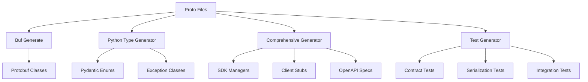

# PostFiat SDK Development Guide

This document describes the code generation architecture and development processes for the PostFiat SDK.

## 🎯 Architecture Overview

The PostFiat SDK follows a **proto-first architecture** where Protocol Buffer definitions are the single source of truth for all generated code.



## 🔧 Code Generation Pipeline

### 1. Protocol Buffer Generation

**Tool:** [Buf CLI](https://buf.build/)
**Config:** `proto/buf.gen.yaml`
**Command:** `buf generate --template buf.gen.yaml`

**Generates:**
- `postfiat/v3/*_pb2.py` - Message classes
- `postfiat/v3/*_pb2_grpc.py` - gRPC service stubs

**Example:**
```bash
cd proto
buf generate --template buf.gen.yaml
```

### 2. Python Type Generation

**Script:** `scripts/generate_python_types.py`
**Purpose:** Generate Pydantic-compatible types from protobuf enums

**Generates:**
- `postfiat/types/enums.py` - Pydantic enum classes
- `postfiat/exceptions.py` - SDK exception hierarchy

**Features:**
- Automatic enum extraction from protobuf
- Pydantic compatibility with conversion methods
- Standard exception hierarchy for SDK errors

**Example:**
```python
# Generated enum usage
from postfiat.types.enums import MessageType, EncryptionMode

msg_type = MessageType.CONTEXTUAL_MESSAGE
encryption = EncryptionMode.NACL_SECRETBOX

# Convert to/from protobuf
pb_value = msg_type.to_protobuf()
pydantic_value = MessageType.from_protobuf(pb_value)
```

### 3. Comprehensive SDK Generation

**Script:** `scripts/generate_protobuf.py`
**Purpose:** Generate complete SDK components from protobuf definitions

**Generates:**
- `postfiat/models/envelope_enums.py` - Message envelope enums
- `postfiat/managers/` - Service manager classes
- `postfiat/services/` - Service implementation stubs
- `postfiat/clients/` - Client wrapper classes
- `postfiat/integrations/discord/` - Discord command mappers
- `api/` - OpenAPI/Swagger specifications

**Features:**
- Automatic service discovery from protobuf
- Manager pattern for service orchestration
- Client stubs for easy API consumption
- OpenAPI generation for REST endpoints
- Discord integration for command handling

### 4. Test Generation

**🆕 Dynamic Test Generator (Recommended):**
**Script:** `scripts/generate_dynamic_protobuf_tests.py`
**Purpose:** Generate comprehensive test suites using runtime proto introspection

**Generates:**
- `tests/generated/test_dynamic_serialization.py` - Round-trip serialization tests
- `tests/generated/test_dynamic_validation.py` - Field and enum validation tests
- `tests/generated/test_dynamic_services.py` - gRPC service method tests
- `tests/generated/test_dynamic_evolution.py` - Schema evolution and compatibility tests

**Key Features:**
- **Runtime Introspection:** Uses actual proto message descriptors (no hardcoded field names)
- **Auto-Adaptation:** Tests automatically adapt when proto schemas change
- **Schema Evolution:** Tests backward compatibility and wire format stability
- **Comprehensive Coverage:** Generates tests for all discovered proto messages

**Test Types:**
- **Serialization Integrity:** Validates round-trip serialization
- **Field Type Validation:** Tests field constraints and types
- **Enum Validation:** Verifies enum values and conversions
- **Service Integration:** Tests service method signatures
- **Schema Evolution:** Tests backward compatibility and field number stability

## 🔄 Development Workflow

### Local Development

1. **Edit Proto Files:**
   ```bash
   # Edit proto/postfiat/v3/*.proto
   vim proto/postfiat/v3/messages.proto
   ```

2. **Generate Code:**
   ```bash
   # Generate protobuf classes
   cd proto && buf generate --template buf.gen.yaml && cd ..
   
   # Generate Python types
   python scripts/generate_python_types.py
   
   # Generate comprehensive SDK (optional)
   python scripts/generate_protobuf.py
   
   # Generate tests
   python scripts/generate_dynamic_protobuf_tests.py
   ```

3. **Test Changes:**
   ```bash
   # Run all tests
   pytest tests/ -v
   
   # Test specific components
   python -c "from postfiat.v3 import messages_pb2; print('✅ Protobuf import works')"
   python -c "from postfiat.types.enums import MessageType; print('✅ Enums work')"
   ```

### CI/CD Pipeline

The CI automatically handles code generation:

**Code Generation Job:**
1. Install dependencies (buf, python packages)
2. Generate protobuf classes
3. Generate Python types and tests
4. Run complete test suite
5. Auto-commit generated files (main branch only)

**Test Matrix Job:**
1. Test across Python 3.10, 3.11, 3.12
2. Verify package installation
3. Generate and run tests
4. Validate SDK functionality

## 📁 Generated File Management

### .gitignore Strategy

**Ignored (Generated) Files:**
```gitignore
# Generated protobuf Python files
postfiat/v3/*_pb2.py
postfiat/v3/*_pb2_grpc.py

# Generated Python types
postfiat/types/enums.py
postfiat/exceptions.py
postfiat/models/envelope_enums.py

# Generated SDK components
postfiat/managers/
postfiat/services/
postfiat/clients/
postfiat/integrations/

# Generated tests
tests/generated/

# Generated API documentation
api/
```

**Committed (Source) Files:**
- `proto/` - Protocol buffer definitions
- `scripts/` - Generation scripts
- `postfiat/__init__.py` - Package root
- `postfiat/client/base.py` - Base client infrastructure
- `tests/manual/` - Manual tests

### Branch-Specific Behavior

**Dev Branch:**
- Generated files ignored
- Clean source-only development
- Developers run generation locally

**Main Branch:**
- Generated files auto-committed by CI
- Browsable generated code on GitHub
- Ready for distribution

## 🧪 Testing Architecture

### Test Organization

```
tests/
├── manual/                    # Manual tests (committed)
│   ├── test_client_integration.py
│   ├── test_business_logic.py
│   └── test_edge_cases.py
└── generated/                 # Auto-generated tests (ignored)
    ├── test_dynamic_serialization.py    # 🆕 Dynamic serialization tests
    ├── test_dynamic_validation.py       # 🆕 Dynamic field/enum validation
    ├── test_dynamic_services.py         # 🆕 Dynamic service tests
    ├── test_dynamic_evolution.py        # 🆕 Schema evolution tests
    ├── test_contract_validation.py      # Legacy hardcoded tests
    ├── test_serialization_integrity.py  # Legacy hardcoded tests
    └── test_persistence_scaffolding.py  # Legacy hardcoded tests
```

### Test Types

**Manual Tests:**
- Business logic validation
- Integration testing
- Edge case handling
- User workflow testing

**Generated Tests (Dynamic):**
- Runtime proto introspection-based testing
- Serialization round-trip testing with actual field discovery
- Field constraint validation using proto descriptors
- Enum value verification from runtime schema
- Service method signature testing
- Schema evolution and backward compatibility testing

## 🔧 Extending the SDK

### Adding New Proto Files

1. **Create proto file:**
   ```protobuf
   // proto/postfiat/v3/new_service.proto
   syntax = "proto3";
   package postfiat.v3;
   
   service NewService {
     rpc DoSomething(DoSomethingRequest) returns (DoSomethingResponse);
   }
   ```

2. **Regenerate code:**
   ```bash
   python scripts/generate_protobuf.py
   ```

3. **Generated automatically:**
   - Service manager class
   - Client stub
   - gRPC service implementation
   - OpenAPI specification
   - Integration tests

### Adding Custom Generators

1. **Create generator script:**
   ```python
   # scripts/generate_custom_component.py
   def generate_custom_component():
       # Your generation logic
       pass
   ```

2. **Add to CI pipeline:**
   ```yaml
   - name: Generate custom component
     run: python scripts/generate_custom_component.py
   ```

## 📊 Monitoring and Debugging

### Structured Logging

**Dependencies:**
- **structlog:** Structured logging with rich context
- **loguru:** Beautiful console output and formatting

**Usage in Development:**
```python
from postfiat.logging import get_logger

logger = get_logger("my_component")
logger.info("Processing request", user_id="123", action="create_wallet")
```

**Environment-Aware Output:**
- **Development/Testing:** Human-readable console output
- **Production:** JSON structured logs
- **pytest:** Plain text for test readability

### Generation Logs

All generation scripts provide detailed structured logging:
```bash
python scripts/generate_python_types.py
# {"event": "Starting protobuf-based type generation", "level": "info", "timestamp": "2025-07-04T16:20:00.123Z"}
# {"enum_types_count": 5, "modules": ["messages", "errors"], "event": "Discovered protobuf definitions", "level": "info"}
# ✅ Generated /path/to/postfiat/types/enums.py
# ✅ Generated /path/to/postfiat/exceptions.py

python scripts/generate_dynamic_protobuf_tests.py
# 🔥 REPLACING BROKEN HARDCODED TEST GENERATOR
# 🎯 NEW: Dynamic Proto Test Generation with Runtime Introspection
# {"event": "Discovered 10 proto message classes", "level": "info", "timestamp": "2025-07-07T10:35:16.856532Z"}
# {"event": "✅ Generated serialization tests: tests/generated/test_dynamic_serialization.py", "level": "info"}
# {"event": "✅ Generated evolution tests: tests/generated/test_dynamic_evolution.py", "level": "info"}
# ✅ SUCCESS: Dynamic proto test generation complete!

python scripts/generate_protobuf.py
# 🚀 Generating comprehensive SDK from protobuf definitions...
# 📊 Found 3 message types and 0 services
# 📝 Generated envelope enums for 3 message types
# ✅ Generation complete!
```

### CI Debugging

Check GitHub Actions for detailed logs:
1. Go to Actions tab
2. Click on failed workflow
3. Expand job steps to see generation output
4. Look for specific error messages

### Common Issues

**Import Errors:**
- Ensure all dependencies installed: `pip install -e .`
- Check namespace consistency: `postfiat.v3` vs `postfiat.wallet.v3`

**Generation Failures:**
- Verify proto syntax: `buf lint`
- Check buf configuration: `buf.yaml` and `buf.gen.yaml`
- Ensure all imports available

**Test Failures:**
- Regenerate dynamic tests: `python scripts/generate_dynamic_protobuf_tests.py`
- Use CI integration: `python scripts/ci_test_generation.py --force`
- Check protobuf message compatibility
- Verify enum values match proto definitions
- For legacy tests: `python scripts/generate_protobuf_tests.py` *(deprecated)*

## � Logging Best Practices

### When to Add Logging

**✅ DO Log:**
- **Factory functions:** Exception creation, object construction
- **Utility methods:** Data processing, transformations
- **API middleware:** Request/response processing
- **Service boundaries:** External API calls, database operations
- **Error handling:** Exception processing and recovery

**❌ DON'T Log:**
- **Pure data classes:** Pydantic models, simple exception classes
- **Getters/setters:** Simple property access
- **Constructors:** Basic object initialization without side effects
- **Pure functions:** Mathematical operations, simple transformations

### Logging Patterns

**Structured Context:**
```python
logger.info(
    "Processing user request",
    user_id=user.id,
    action="create_wallet",
    request_id=request_id,
    duration_ms=elapsed_time
)
```

**Error Logging:**
```python
logger.error(
    "Database operation failed",
    operation="insert_wallet",
    table="wallets",
    error_code=exc.error_code,
    retry_count=retry_count,
    exc_info=True  # Include stack trace
)
```

**Debug Information:**
```python
logger.debug(
    "Cache operation",
    cache_key=key,
    cache_hit=hit,
    ttl_seconds=ttl
)
```

### Generated Code Logging

The code generators automatically add logging to:
- **Exception factory functions:** `create_exception_from_error_code()`
- **Error processing utilities:** `create_exception_from_error_info()`
- **Serialization methods:** `PostFiatError.to_dict()`
- **Test generation:** Discovery and generation progress

Pure data classes (enums, simple exceptions) remain clean without logging.

## 🚀 Performance Considerations

### Generation Speed

- **Incremental generation:** Only regenerate changed components
- **Parallel processing:** Use multiple cores where possible
- **Caching:** Cache generated artifacts between runs

### Runtime Performance

- **Lazy imports:** Import generated modules only when needed
- **Connection pooling:** Reuse gRPC connections
- **Serialization optimization:** Use efficient protobuf serialization

## 📋 Best Practices

1. **Proto-first development:** Always start with proto definitions
2. **Consistent naming:** Follow protobuf naming conventions
3. **Backward compatibility:** Use field numbers carefully
4. **Documentation:** Document proto files thoroughly
5. **Testing:** Test both manual and generated components
6. **Version management:** Use semantic versioning for releases

This architecture ensures maintainable, scalable, and robust SDK development with minimal manual overhead. 🎯
