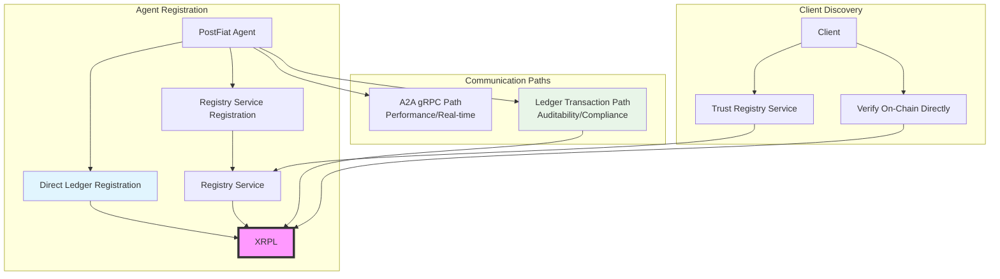
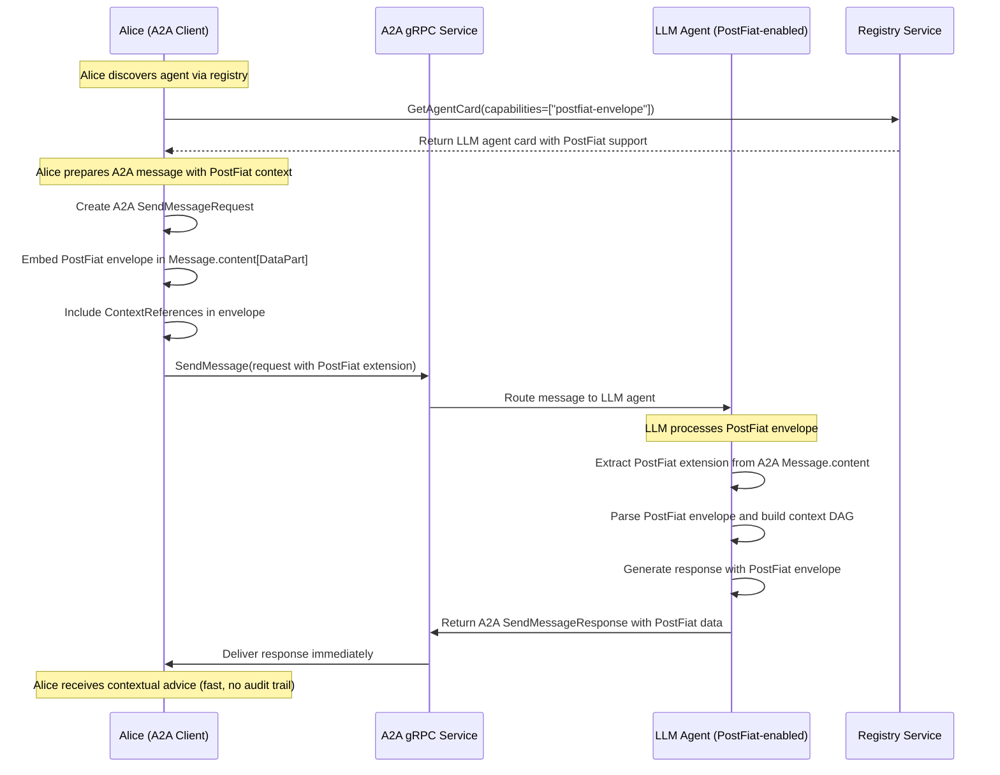
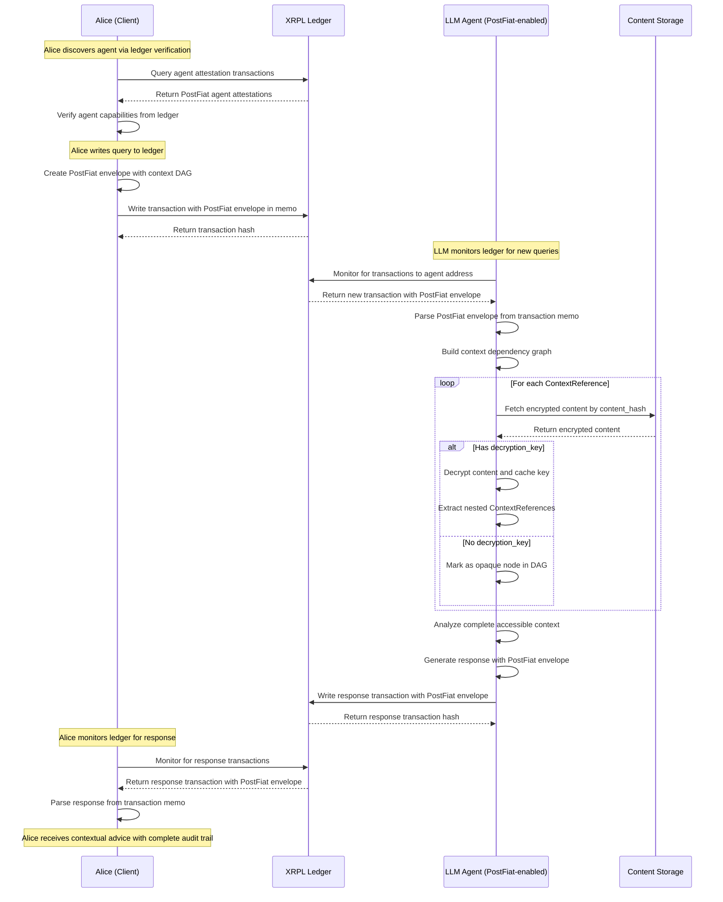
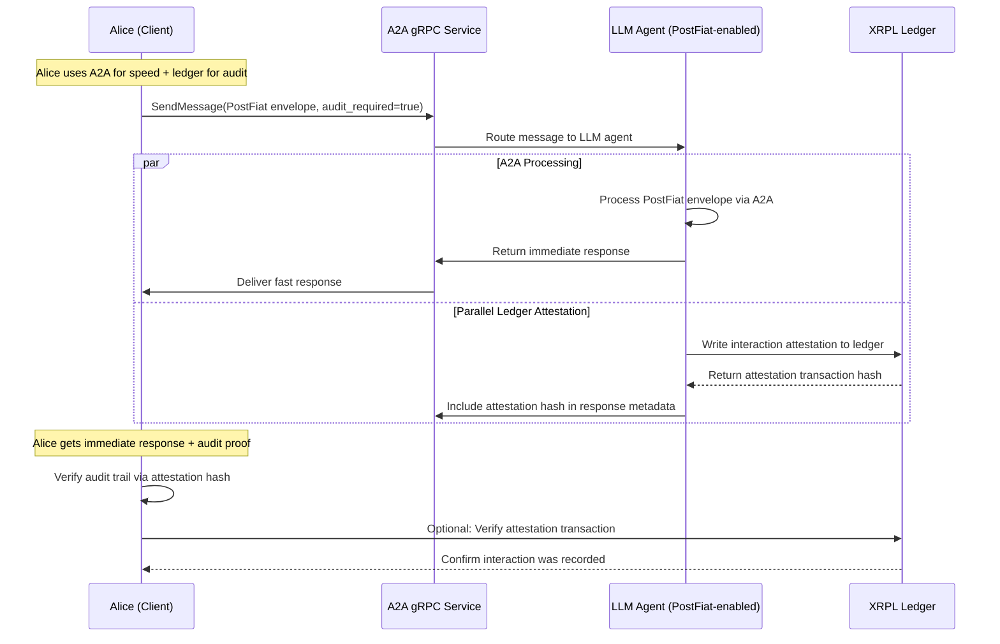
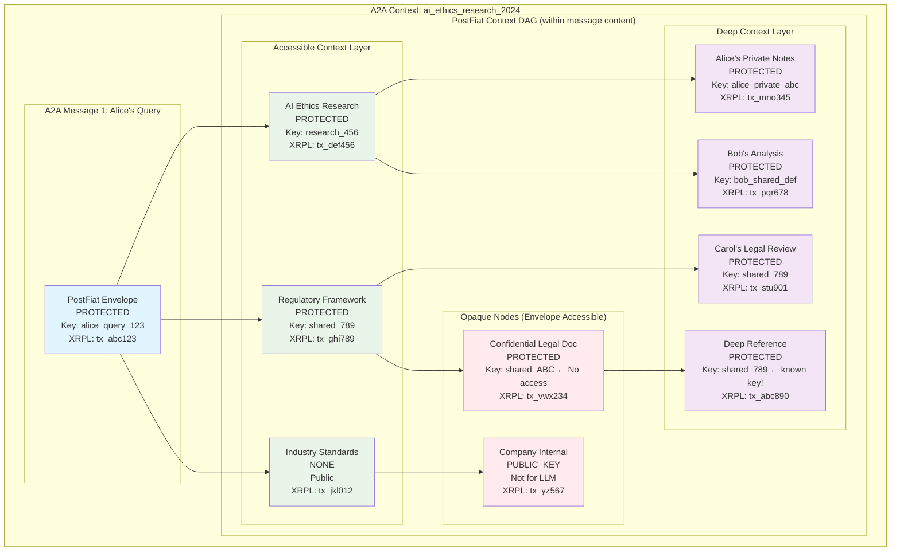
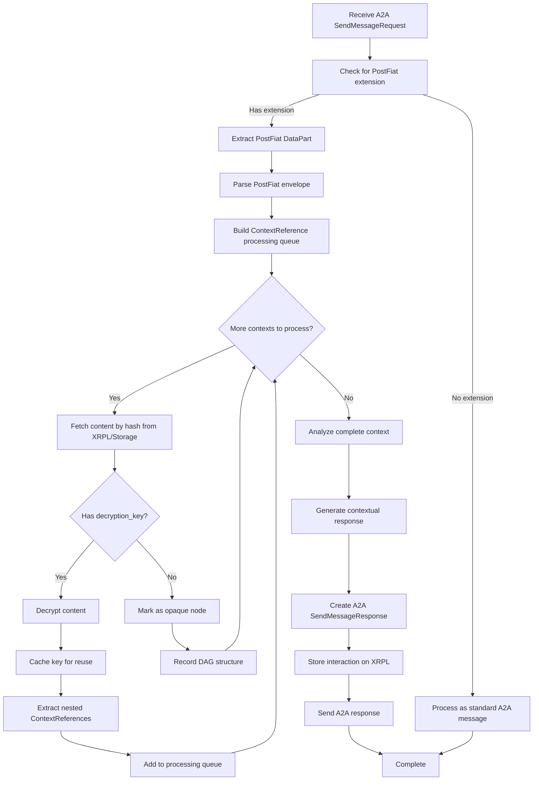

# PostFiat SDK: Protected Content and Auditability Extension for A2A gRPC

**Research Area:** Extending A2A gRPC with protected content for immutable ledger persistence  
**Date:** 2025-07-04  
**Status:** Research Phase - Protocol Extension Design  
**Base Protocol:** [A2A gRPC Specification](https://github.com/a2aproject/A2A/blob/main/specification/grpc/a2a.proto)  
**Core Value Add:** Protected content + XRPL persistence as A2A extension

---

## 🎯 PostFiat SDK Value Proposition

**Precise Innovation:** Three specific capabilities added to A2A gRPC:

1. **Envelope-based Context Sharing** - Privacy-preserving collaboration discovery through cryptographic context sharing
2. **Public Record & Attestation** - XRPL blockchain storage for permanent, tamper-proof agent interaction records and capability attestations
3. **Hybrid Communication Model** - Choice between A2A gRPC (performance) and ledger transactions (auditability/compliance)

**Architecture Principle:** PostFiat **extends A2A** with ledger-based public record capabilities. Agents can communicate via A2A gRPC for efficiency or ledger transactions for auditability, with registry services aggregating both sources.

---

## 🏛️ Public Record & Attestation Model

### Core Concept: Agents as Public Entities

**Public Record Principle:** Agent capabilities, interactions, and attestations are matters of **public record** stored on XRPL ledger. This enables:

- **Verifiable agent capabilities** - Anyone can verify what an agent claims to support
- **Audit trails** - Complete interaction history for compliance and accountability
- **Trust without intermediaries** - Clients can verify agent behavior directly from ledger
- **Regulatory compliance** - Immutable records for auditing and legal requirements

### Hybrid Communication Architecture



**Key Insight:** Agents choose their registration method (direct ledger vs registry service), and clients choose their verification method (trust aggregator vs direct on-chain verification).

---

## 📋 A2A gRPC Foundation Analysis

### Core A2A Structures We Build Upon

From [`a2a.proto`](https://github.com/a2aproject/A2A/blob/main/specification/grpc/a2a.proto), the key structures we extend:

```protobuf
// A2A's core message structure - we use this as-is
message Message {
  string message_id = 1;
  string context_id = 2;      // A2A conversation threading
  string task_id = 3;         // A2A task management
  Role role = 4;              // ROLE_USER or ROLE_AGENT
  repeated Part content = 5;  // ← PostFiat protected content goes here
  google.protobuf.Struct metadata = 6;
  repeated string extensions = 7;  // ← PostFiat extension URI
}

// A2A's content container - we use DataPart for structured protected content
message Part {
  oneof part {
    string text = 1;
    FilePart file = 2;
    DataPart data = 3;  // ← PostFiat protected envelopes
  }
}

// A2A's agent capabilities - we extend this
message AgentCapabilities {
  bool streaming = 1;
  bool push_notifications = 2;
  repeated AgentExtension extensions = 3;  // ← PostFiat protected content extension
}
```

### A2A Service Interface We Use

```protobuf
service A2AService {
  // We use these A2A methods as-is
  rpc SendMessage(SendMessageRequest) returns (SendMessageResponse);
  rpc SendStreamingMessage(SendMessageRequest) returns (stream StreamResponse);
  rpc GetTask(GetTaskRequest) returns (Task);
  rpc GetAgentCard(GetAgentCardRequest) returns (AgentCard);
}
```

---

## 🔧 PostFiat SDK Extension Design

### PostFiat as A2A Extension

**Extension URI:** `https://postfiat.org/extensions/envelope/v1`

**Integration Method:** PostFiat envelopes are embedded in A2A `Message.content` as `DataPart` structures.

### Content-Addressable Model

**Key Insight:** PostFiat uses **content-addressable encryption** where the content hash serves as the addressable entity, complementary to A2A's `context_id`:

- **A2A `context_id`:** Conversation threading and message grouping
- **PostFiat `content_address`:** Cryptographic content identification (`sha256(envelope_content)`)
- **XRPL `transaction_hash`:** Immutable ledger proof (assigned after submission)

**Content Address Benefits:**
- Available immediately at content creation time
- Enables content-addressable retrieval from storage
- Cryptographically verifiable content integrity
- Independent of ledger transaction timing

### A2A Context ID Collision Prevention

**Issue:** A2A gRPC specification doesn't explicitly address `Message.context_id` collision prevention. Simple IDs like "conversation_1" could cause accidental context mixing between agents.

**PostFiat Recommendation:** Use collision-resistant context ID generation:

```python
def generate_a2a_context_id(agent_id: str, session_info: str) -> str:
    """Generate collision-resistant A2A context_id"""
    import uuid
    import hashlib

    # Option 1: Namespaced UUID
    namespace_uuid = uuid.uuid5(uuid.NAMESPACE_DNS, agent_id)
    context_uuid = uuid.uuid5(namespace_uuid, session_info)
    return f"{agent_id}::{context_uuid}"

    # Option 2: Cryptographic hash
    content = f"{agent_id}::{session_info}::{uuid.uuid4()}"
    return f"ctx_{hashlib.sha256(content.encode()).hexdigest()[:16]}"

# Example usage
a2a_context_id = generate_a2a_context_id(
    agent_id="postfiat_research_agent_001",
    session_info="alice_regulatory_analysis_2024"
)
# Result: "postfiat_research_agent_001::a1b2c3d4-e5f6-7890-abcd-ef1234567890"
```

**Dual Context Model:**
- **A2A `context_id`:** Collision-resistant conversation threading
- **PostFiat `content_address`:** Content-addressable cryptographic identification
- **Complementary:** Both serve different purposes without conflict

```protobuf
// PostFiat extension for A2A
message PostFiatExtension {
  // PostFiat envelope (from PostFiat SDK messages.proto)
  Envelope envelope = 1;

  // Content address (hash of content) - available immediately for content-addressable encryption
  string content_address = 2;

  // Ledger transaction hash - assigned by ledger node after submission (not available at creation time)
  optional string ledger_transaction_hash = 3;

  // Context DAG processing configuration
  PostFiatContextProcessingConfig processing_config = 4;
}

// PostFiat-specific type (not part of A2A)
message PostFiatContextProcessingConfig {
  // Maximum depth for context DAG traversal
  uint32 max_context_depth = 1;

  // Whether to include opaque node metadata in responses
  bool include_opaque_nodes = 2;

  // Processing timeout for context resolution
  uint32 timeout_seconds = 3;
}
```

### A2A Message with PostFiat Extension

```protobuf
// How PostFiat protected content integrates with A2A Message
// This uses the actual A2A Message structure from a2a.proto
SendMessageRequest {
  Message request = 1 {
    string message_id = "msg_12345";
    string context_id = "ai_ethics_research_2024";  // A2A conversation threading
    string task_id = "task_67890";                  // A2A task management
    Role role = ROLE_USER;                          // From A2A enum
    
    // PostFiat envelope content
    repeated Part content = [
      {
        DataPart data = {
          // PostFiat extension data as google.protobuf.Struct
          "postfiat_envelope": {
            "envelope": {
              "version": 1,
              "content_hash": "sha256:abc123...",
              "encryption": "PROTECTED",
              "public_references": [...],
              "message": "encrypted_content_bytes"
            },
            "content_address": "sha256:envelope_content_hash...",  // Available immediately
            // "xrpl_transaction_hash": "tx_def456...",  // Added after ledger confirmation
            "processing_config": {
              "max_context_depth": 10,
              "include_opaque_nodes": true,
              "timeout_seconds": 30
            }
          }
        }
      }
    ];

    // A2A metadata + PostFiat metadata
    google.protobuf.Struct metadata = {
      "postfiat_version": "1.0.0",
      "envelope_enabled": true
    };

    // PostFiat extension declaration
    repeated string extensions = [
      "https://postfiat.org/extensions/envelope/v1"
    ];
  };
  
  // A2A configuration
  SendMessageConfiguration configuration = {
    repeated string accepted_output_modes = ["text/plain", "application/json"];
    bool blocking = true;
  };
}
```

### Agent Registration: A2A + Ledger Attestation

**Hybrid Registration Model:** Agents can register capabilities through multiple paths:

1. **Direct Ledger Registration** - Agent writes capability attestation directly to XRPL
2. **Registry Service Registration** - Agent registers with registry service, which writes to XRPL
3. **A2A Agent Card** - Traditional A2A service discovery (can be backed by ledger attestations)

**Public Record Benefit:** All registration methods result in verifiable on-chain attestations, enabling client choice between trusting aggregators or verifying directly.

#### Option 1: Direct Ledger Registration

```protobuf
// PostFiat agent capability attestation written directly to XRPL memo
message PostFiatAgentAttestation {
  // Agent identity
  string agent_id = "agent_postfiat_research_001";
  string agent_name = "PostFiat Research Assistant";
  string agent_description = "AI agent with envelope-based context sharing";

  // Service endpoints
  string grpc_endpoint = "https://agent.postfiat.org:443";
  string ledger_address = "rPostFiatAgent123...";

  // PostFiat capabilities
  PostFiatCapabilities postfiat_capabilities = {
    string extension_uri = "https://postfiat.org/extensions/envelope/v1";
    uint32 max_context_depth = 10;
    repeated string supported_encryption_modes = ["NONE", "PROTECTED", "PUBLIC_KEY"];
    string xrpl_network = "mainnet";
    bool context_dag_traversal = true;
    bool immutable_storage = true;
  };

  // Attestation metadata
  int64 attestation_timestamp = 1704067200;
  string attestation_signature = "agent_signature_proof";
}

// XRPL Transaction with agent attestation
XRPLTransaction {
  account: "rPostFiatAgent123...",
  transaction_type: "Payment",
  destination: "rPostFiatRegistry456...",
  amount: "1",  // Minimal XRP for transaction
  memos: [
    {
      memo_type: "postfiat/agent-attestation/v1",
      memo_data: base64_encode(PostFiatAgentAttestation)
    }
  ]
}
```

#### Option 2: Registry Service Registration + Ledger Attestation

```protobuf
// A2A AgentCard with PostFiat extension + ledger backing
AgentCard {
  string protocol_version = "1.0";  // A2A protocol version
  string name = "PostFiat Research Assistant";
  string description = "AI agent with envelope-based context sharing and XRPL attestation";
  string url = "https://agent.postfiat.org";
  string preferred_transport = "GRPC";

  AgentProvider provider = {
    string url = "https://postfiat.org";
    string organization = "PostFiat";
  };

  string version = "1.0.0";
  string documentation_url = "https://docs.postfiat.org";

  // A2A capabilities extended with PostFiat + ledger attestation
  AgentCapabilities capabilities = {
    bool streaming = true;
    bool push_notifications = true;

    repeated AgentExtension extensions = [
      {
        string uri = "https://postfiat.org/extensions/envelope/v1";
        string description = "PostFiat envelope with context DAG traversal and XRPL persistence";
        bool required = false;
        google.protobuf.Struct params = {
          "max_context_depth": 10,
          "supported_encryption_modes": ["NONE", "PROTECTED", "PUBLIC_KEY"],
          "xrpl_network": "mainnet",
          "context_dag_traversal": true,
          "immutable_storage": true,
          // Ledger attestation reference
          "ledger_attestation_tx": "tx_abc123...",
          "ledger_address": "rPostFiatAgent123..."
        };
      }
    ];
  };

  repeated AgentSkill skills = [
    {
      string id = "contextual_analysis";
      string name = "Contextual Analysis with PostFiat Envelopes";
      string description = "Analyze queries using PostFiat context DAG traversal with ledger attestation";
      repeated string tags = ["analysis", "context", "privacy", "auditable"];
      repeated string examples = [
        "Analyze this research with my private context (auditable)",
        "What are the implications given my collaboration history? (compliance mode)"
      ];
      repeated string input_modes = ["text/plain", "application/postfiat-envelope"];
      repeated string output_modes = ["text/plain", "application/json"];
    }
  ];
}
```

#### Client Discovery Options

```python
class PostFiatAgentDiscovery:
    """Client can choose verification method"""

    async def discover_agents_via_registry(self, capabilities: List[str]) -> List[AgentCard]:
        """Trust registry service aggregation"""
        registry_client = A2ARegistryClient()
        return await registry_client.find_agents_with_capabilities(capabilities)

    async def discover_agents_via_ledger(self, capabilities: List[str]) -> List[PostFiatAgentAttestation]:
        """Verify directly from XRPL ledger"""
        xrpl_client = XRPLClient()

        # Query XRPL for agent attestation transactions
        attestation_txs = await xrpl_client.get_transactions_with_memo_type(
            "postfiat/agent-attestation/v1"
        )

        # Parse and filter by capabilities
        agents = []
        for tx in attestation_txs:
            attestation = self.parse_agent_attestation(tx.memo_data)
            if self.agent_supports_capabilities(attestation, capabilities):
                agents.append(attestation)

        return agents

    async def verify_agent_attestation(self, agent_id: str) -> bool:
        """Cross-verify registry claims against ledger"""
        # Get agent info from registry
        registry_info = await self.discover_agents_via_registry([])

        # Get attestation from ledger
        ledger_attestation = await self.discover_agents_via_ledger([])

        # Verify consistency
        return self.verify_consistency(registry_info, ledger_attestation)
```

---

## 🔄 Hybrid Communication Patterns

### Communication Mode Selection

**Decision Matrix:** When to use A2A gRPC vs Ledger Transactions

| **Scenario** | **Communication Method** | **Rationale** |
|--------------|-------------------------|---------------|
| Real-time collaboration | A2A gRPC | Performance, streaming, immediate response |
| Compliance-required interaction | Ledger Transaction | Immutable audit trail, regulatory requirements |
| High-stakes decision | Ledger Transaction | Verifiable record, accountability |
| Internal agent coordination | A2A gRPC | Efficiency, no audit requirements |
| Public attestation | Ledger Transaction | Public verifiability, transparency |
| Development/testing | A2A gRPC | Speed, cost efficiency |

### Primary Use Case: Alice Consulting LLM with Hybrid Communication

**Scenario:** Alice uses both A2A gRPC (for efficiency) and ledger transactions (for auditability) when consulting an LLM agent about regulatory compliance research.

#### Option A: A2A gRPC Communication (Performance Mode)



#### Option B: Ledger Transaction Communication (Audit Mode)



#### Option C: Hybrid Communication (Best of Both)



---

## 📊 Context DAG Structure with A2A Integration

### A2A Context vs PostFiat Context

**A2A Context:** `Message.context_id` provides conversation threading across multiple A2A messages
**PostFiat Context:** `ContextReference` DAG provides cryptographic content access control within message content



**Legend:**
- 🔵 **Blue:** A2A Message with PostFiat content
- 🟢 **Green:** Accessible context (agent has keys)
- 🟣 **Purple:** Deep accessible context
- 🔴 **Red:** Opaque nodes (no content access, but envelope/structure visible)

**Key Insight:** Even opaque nodes contribute to DAG structure - agents can see that references exist and traverse the graph topology, even when content is encrypted. All nodes have XRPL transaction hashes for immutable audit trails.

---

## 🔄 Context DAG Traversal Algorithm

### LLM Processing Flow with A2A Integration



### Key Collection and Caching Strategy

```python
class PostFiatA2AAgent:
    """A2A agent with PostFiat envelope capabilities"""

    def __init__(self):
        self.key_cache = {}  # content_hash -> decryption_key
        self.content_cache = {}  # content_hash -> decrypted_content
        self.context_dag = {}  # content_hash -> PostFiatContextNode

    async def handle_a2a_message(self, request: SendMessageRequest) -> SendMessageResponse:
        """Process A2A message with potential PostFiat extension"""

        message = request.request

        # Check for PostFiat extension
        if "https://postfiat.org/extensions/envelope/v1" not in message.extensions:
            return await self.handle_standard_a2a_message(request)

        # Extract PostFiat envelope from DataPart
        postfiat_data = None
        for part in message.content:
            if part.HasField('data'):
                data_struct = part.data.data
                if 'postfiat_envelope' in data_struct:
                    postfiat_data = data_struct['postfiat_envelope']
                    break

        if not postfiat_data:
            return await self.handle_standard_a2a_message(request)

        # Process PostFiat envelope
        envelope = self.parse_envelope(postfiat_data['envelope'])
        content_address = postfiat_data.get('content_address')
        processing_config = postfiat_data.get('processing_config', {})

        # Verify content address matches envelope
        computed_address = self.compute_content_address(envelope)
        if content_address != computed_address:
            raise ValueError(f"Content address mismatch: {content_address} != {computed_address}")

        # Build context DAG
        context_dag = await self.build_context_dag(
            envelope.public_references,
            max_depth=processing_config.get('max_context_depth', 10),
            timeout=processing_config.get('timeout_seconds', 30)
        )

        # Generate response
        response_content = await self.generate_contextual_response(
            envelope, context_dag, message.context_id
        )

        # Create response content address
        response_address = self.compute_content_address(response_content)

        # Store on XRPL (async - transaction hash not immediately available)
        xrpl_tx_hash = await self.store_on_xrpl(message, response_content)

        # Create A2A response
        response_message = Message(
            message_id=f"response_{message.message_id}",
            context_id=message.context_id,
            task_id=message.task_id,
            role=Role.ROLE_AGENT,
            content=[
                Part(data=DataPart(data=Struct(fields={
                    'postfiat_envelope': Value(struct_value=Struct(fields={
                        'envelope': self.envelope_to_struct(response_content),
                        'content_address': Value(string_value=response_address),
                        'xrpl_transaction_hash': Value(string_value=xrpl_tx_hash),  # May be None initially
                        'context_dag_summary': self.dag_summary_to_struct(context_dag)
                    }))
                })))
            ],
            extensions=["https://postfiat.org/extensions/envelope/v1"]
        )

        return SendMessageResponse(msg=response_message)

    def compute_content_address(self, envelope: Envelope) -> str:
        """Compute content-addressable hash for envelope"""
        import hashlib
        envelope_bytes = envelope.SerializeToString()
        return f"sha256:{hashlib.sha256(envelope_bytes).hexdigest()}"
```

---

## 🎯 Key Insights and Implementation Strategy

### Critical Insights

1. **A2A Provides Complete Infrastructure** - Service discovery, routing, task management, streaming, capability negotiation - we don't reinvent any of this

2. **PostFiat as Content Extension** - Our envelopes live in A2A `Message.content` as `DataPart` structures

3. **Hybrid Discovery Model** - Agents can register directly on ledger OR via registry service; clients can trust aggregators OR verify on-chain directly

4. **Communication Choice** - A2A gRPC for performance/real-time, ledger transactions for auditability/compliance

5. **Public Record Principle** - Agent capabilities and critical interactions become matters of public record on XRPL

6. **Observer++ Pattern** - Registry services aggregate both A2A registrations and on-chain attestations

7. **Dual Context Model** - A2A `context_id` for conversation threading, PostFiat `ContextReference` DAG for cryptographic access control

8. **Clear Type Boundaries** - A2A types used as-is, PostFiat-specific types prefixed with `PostFiat`

### Implementation Strategy

**Phase 1: A2A Integration Foundation**
- Implement A2A gRPC client/server using existing A2A libraries
- Create PostFiat extension registration in `AgentCard`
- Design `DataPart` structure for protected content envelopes

**Phase 2: PostFiat Envelope Extension**
- Embed PostFiat `Envelope` messages in A2A `Message.content`
- Implement context DAG traversal within A2A message processing
- Add key caching and management for collaborative workspaces

**Phase 3: XRPL Persistence Layer**
- Store all PostFiat-enabled A2A interactions on XRPL
- Provide transaction hash proofs in A2A responses
- Enable content-addressable retrieval from blockchain

**Phase 4: Production Deployment**
- Deploy PostFiat agents with hybrid registration (A2A + ledger attestation)
- Test multi-agent envelope scenarios across both communication modes
- Performance optimization and security audit
- Regulatory compliance validation for ledger-based interactions

### A2A Dependency Integration

```python
# PostFiat SDK depends on A2A gRPC libraries
dependencies = [
    "a2a-grpc-python>=1.0.0",  # A2A gRPC client/server
    "postfiat-envelope>=1.0.0",  # PostFiat envelope system
    "xrpl-py>=2.0.0",  # XRPL blockchain integration
]

class PostFiatA2AService(A2AService):
    """PostFiat-enabled A2A service"""

    def __init__(self):
        super().__init__()
        self.register_extension("https://postfiat.org/extensions/envelope/v1")
        self.envelope_processor = PostFiatEnvelopeProcessor()
        self.xrpl_client = XRPLClient()
```

---

**Next Steps:**
1. **Study A2A Python implementation** for integration compatibility
2. **Design PostFiat DataPart structure** for A2A Message embedding
3. **Prototype hybrid agent** supporting both A2A gRPC and ledger communication
4. **Implement ledger attestation system** for agent registration and interaction records
5. **Test context DAG traversal** across both communication modes
6. **Build registry aggregation service** for observer++ pattern implementation
