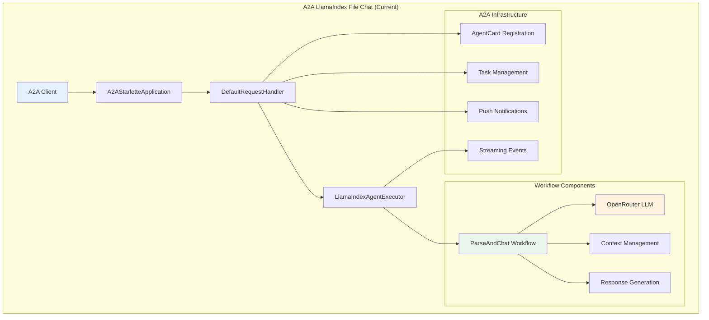
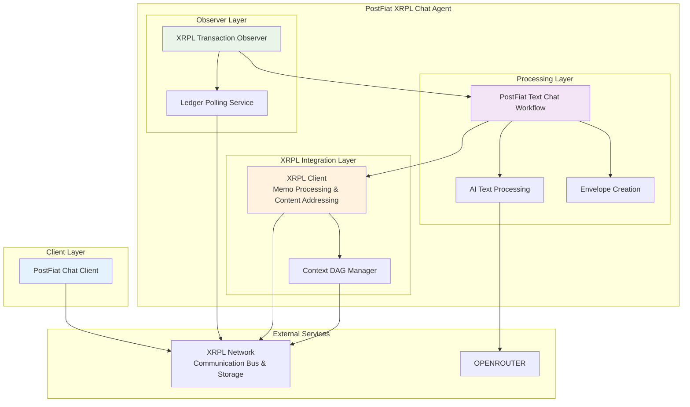
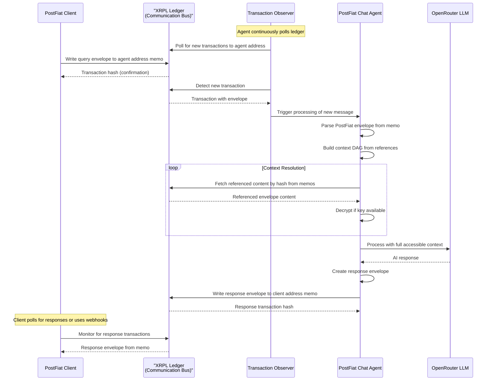
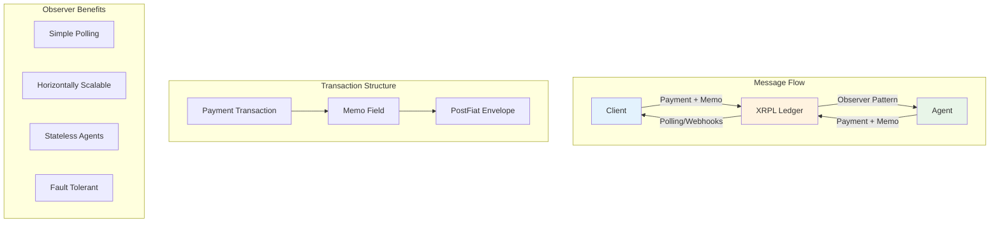

# PostFiat SDK: Adapting A2A LlamaIndex File Chat for XRPL-Based Chat Application

**Research Area:** Adapting A2A LlamaIndex file chat application for XRPL blockchain integration  
**Date:** 2025-07-07  
**Status:** Research Phase - Architecture Analysis  
**Base Application:** [A2A LlamaIndex File Chat](third_party/a2a_llama_index_file_chat/)  
**Target Platform:** XRPL Ledger with PostFiat selective disclosure extension  
**Core Innovation:** Immutable chat history + selective disclosure + AI-powered document analysis

---

## 🎯 Executive Summary

The A2A LlamaIndex file chat application provides an excellent foundation for building an XRPL-based chat application with PostFiat selective disclosure capabilities. The existing application demonstrates:

1. **A2A Protocol Integration** - Complete gRPC service implementation with agent cards
2. **LlamaIndex Workflows** - Sophisticated conversational AI processing
3. **Streaming Support** - Real-time status updates and response streaming
4. **Session Management** - Context persistence across multi-turn conversations
5. **Text Processing** - Natural language understanding and response generation

**Adaptation Strategy:** Simplify the A2A application to use XRPL ledger as the sole communication bus, with agents polling for incoming transactions and responding via ledger messages. This creates a pure ledger-based chat system with built-in immutability and auditability.

---

## 📋 Current A2A Application Analysis

### Architecture Overview



### Key Components Analysis

#### 1. A2A Service Layer (`__main__.py`)
**Current Implementation:**
- **AgentCard Definition:** Declares capabilities, skills, and supported input/output modes
- **Service Registration:** A2A protocol compliance with streaming and push notification support
- **Dependency Management:** OpenRouter API and LlamaCloud API key validation

**Adaptation Opportunities:**
- Add PostFiat extension declaration in AgentCapabilities
- Include XRPL network configuration in agent metadata
- Register selective disclosure capabilities

#### 2. Agent Executor (`agent_executor.py`)
**Current Implementation:**
- **Session Management:** Context state persistence by session ID
- **A2A Message Processing:** Converts A2A messages to workflow events
- **Error Handling:** Comprehensive error management with A2A error types
- **Artifact Generation:** Creates A2A-compliant response artifacts

**Adaptation Opportunities:**
- Extract PostFiat envelopes from A2A Message DataPart
- Implement XRPL transaction storage for audit trails
- Add selective disclosure context DAG processing

#### 3. Workflow Engine (`agent.py`)
**Current Implementation:**
- **Text Processing:** OpenRouter LLM with structured output
- **Conversational AI:** Natural language understanding and generation
- **Response Generation:** Contextual AI responses
- **Context Persistence:** Multi-turn conversation support

**Adaptation Opportunities:**
- Integrate PostFiat envelope creation and processing
- Add XRPL memo field storage for immutable chat history
- Implement selective disclosure key management

---

## 🔄 XRPL Integration Architecture

### Proposed Ledger-Only Architecture



### Communication Pattern: Pure Ledger-Based


---

## 💾 XRPL as Communication Bus and Storage

### XRPL as Unified Communication Layer

**Key Innovation:** XRPL serves as both the communication bus and storage layer. All messages are sent as Payment transactions with PostFiat envelopes in memo fields, creating a pure ledger-based chat system.

#### Communication Pattern


#### Transaction Structure
```json
{
  "TransactionType": "Payment",
  "Account": "rPostFiatAgent123...",
  "Destination": "rPostFiatAgent123...",
  "Amount": "1",
  "Memos": [
    {
      "Memo": {
        "MemoType": "706F73746669617420636861742F7631",  // "postfiat/chat/v1" in hex
        "MemoData": "base64_encoded_postfiat_envelope"
      }
    }
  ]
}
```

#### Observer Pattern Implementation
1. **Agent Registration**: Agent publishes its XRPL address for receiving messages
2. **Continuous Polling**: Agent polls XRPL for new transactions to its address
3. **Message Processing**: Extract and process PostFiat envelopes from memos
4. **Response Generation**: Create response envelope and send back to client address

#### Advantages of Ledger-Only Communication
- **Pure Immutability**: All communication permanently recorded on ledger
- **Simplified Architecture**: No real-time servers or WebSocket connections needed
- **Horizontal Scalability**: Multiple agent instances can poll the same address
- **Fault Tolerance**: Agents can restart and resume from last processed transaction
- **Cost Effective**: Minimal XRP cost per message
- **Global Accessibility**: Messages accessible from any XRPL node
- **Built-in Audit Trail**: Complete conversation history with cryptographic proof

---

## 🛠️ Implementation Strategy

### Phase 1: XRPL Observer Pattern

#### 1.1 XRPL Transaction Observer
**New File:** `postfiat_chat/xrpl_observer.py`

```python
import asyncio
import logging
from typing import Optional, Callable
from xrpl.clients import JsonRpcClient
from xrpl.models.requests import AccountTx
from postfiat.v3.messages_pb2 import PostFiatEnvelopePayload
import base64

class XRPLTransactionObserver:
    """Observer that polls XRPL for new transactions to agent address."""

    def __init__(self, agent_address: str, network_url: str = "https://s1.ripple.com:51234/"):
        self.agent_address = agent_address
        self.client = JsonRpcClient(network_url)
        self.last_processed_ledger = None
        self.message_handler: Optional[Callable] = None
        self.polling_interval = 5  # seconds
        self.running = False
        self.logger = logging.getLogger(__name__)

    def set_message_handler(self, handler: Callable[[PostFiatEnvelopePayload, str], None]):
        """Set the callback function for processing new messages."""
        self.message_handler = handler

    async def start_polling(self):
        """Start continuous polling for new transactions."""
        self.running = True
        self.logger.info(f"Starting XRPL observer for address: {self.agent_address}")

        while self.running:
            try:
                await self._poll_for_new_transactions()
                await asyncio.sleep(self.polling_interval)
            except Exception as e:
                self.logger.error(f"Error during polling: {e}")
                await asyncio.sleep(self.polling_interval * 2)  # Back off on error

    async def stop_polling(self):
        """Stop the polling loop."""
        self.running = False
        self.logger.info("Stopping XRPL observer")

    async def _poll_for_new_transactions(self):
        """Poll XRPL for new transactions to agent address."""
        request = AccountTx(
            account=self.agent_address,
            limit=20,  # Process in small batches
            ledger_index_min=self.last_processed_ledger or -1
        )

        response = await self.client.request(request)

        if response.is_successful():
            transactions = response.result.get("transactions", [])

            for tx_data in reversed(transactions):  # Process oldest first
                await self._process_transaction(tx_data)

                # Update last processed ledger
                ledger_index = tx_data.get("ledger_index")
                if ledger_index and (not self.last_processed_ledger or ledger_index > self.last_processed_ledger):
                    self.last_processed_ledger = ledger_index

    async def _process_transaction(self, tx_data: dict):
        """Process a single transaction for PostFiat envelopes."""
        transaction = tx_data.get("transaction", {})

        # Only process Payment transactions with memos
        if transaction.get("TransactionType") != "Payment":
            return

        if "Memos" not in transaction:
            return

        # Extract PostFiat envelopes from memos
        for memo in transaction["Memos"]:
            memo_data = memo.get("Memo", {})
            memo_type = memo_data.get("MemoType", "")

            try:
                # Decode memo type
                decoded_type = base64.b64decode(memo_type).decode('utf-8')

                if decoded_type == "postfiat/chat/v1":
                    # Extract and process PostFiat envelope
                    memo_content = base64.b64decode(memo_data.get("MemoData", ""))
                    envelope_payload = PostFiatEnvelopePayload.FromString(memo_content)

                    # Call message handler if set
                    if self.message_handler:
                        tx_hash = transaction.get("hash", "")
                        await self.message_handler(envelope_payload, tx_hash)

            except Exception as e:
                self.logger.warning(f"Failed to process memo: {e}")
```

#### 1.2 Ledger-Based Chat Agent
**New File:** `postfiat_chat/ledger_chat_agent.py`

```python
import asyncio
import logging
from typing import Optional
from postfiat.v3.messages_pb2 import PostFiatEnvelopePayload, Envelope
from .xrpl_observer import XRPLTransactionObserver
from .xrpl_client import XRPLChatClient
from llama_index.llms.openrouter import OpenRouter
import os
import json

class LedgerChatAgent:
    """Pure ledger-based chat agent using XRPL observer pattern."""

    def __init__(self, agent_address: str, agent_seed: str):
        self.agent_address = agent_address
        self.observer = XRPLTransactionObserver(agent_address)
        self.xrpl_client = XRPLChatClient()
        self.llm = OpenRouter(
            model='anthropic/claude-3.5-haiku',
            max_tokens=10000,
            api_key=os.getenv('OPENROUTER_API_KEY')
        )
        self.logger = logging.getLogger(__name__)

        # Initialize XRPL wallet
        asyncio.create_task(self.xrpl_client.initialize_agent_wallet(agent_seed))

        # Set up message handler
        self.observer.set_message_handler(self.handle_incoming_message)

    async def start(self):
        """Start the ledger-based chat agent."""
        self.logger.info(f"Starting ledger chat agent at address: {self.agent_address}")
        await self.observer.start_polling()

    async def stop(self):
        """Stop the chat agent."""
        await self.observer.stop_polling()

    async def handle_incoming_message(self, envelope_payload: PostFiatEnvelopePayload, tx_hash: str):
        """Handle incoming message from XRPL transaction."""
        try:
            self.logger.info(f"Processing message from transaction: {tx_hash}")

            # Extract message content from envelope
            envelope = envelope_payload.envelope
            message_content = envelope.message  # Assuming text content

            # Build context DAG if references exist
            context_dag = {}
            if envelope.public_references:
                context_dag = await self.xrpl_client.build_context_dag(
                    list(envelope.public_references)
                )

            # Generate AI response
            response = await self.generate_response(message_content, context_dag)

            # Create response envelope
            response_envelope = await self.create_response_envelope(response, tx_hash)

            # Send response back to client (extract from original transaction)
            client_address = await self.extract_client_address(tx_hash)
            if client_address:
                await self.send_response(response_envelope, client_address)

        except Exception as e:
            self.logger.error(f"Error processing message: {e}")

    async def generate_response(self, message_content: str, context_dag: dict) -> str:
        """Generate AI response with context awareness."""
        # Build context-aware prompt
        context_info = ""
        if context_dag:
            accessible_contexts = [
                node for node in context_dag.values()
                if node.get('accessible', False)
            ]
            if accessible_contexts:
                context_info = f"\nContext: {len(accessible_contexts)} referenced messages available."

        # Generate response using LLM
        prompt = f"{message_content}{context_info}"
        response = await self.llm.achat([{"role": "user", "content": prompt}])

        return response.message.content

    async def create_response_envelope(self, response_content: str, original_tx_hash: str) -> PostFiatEnvelopePayload:
        """Create PostFiat envelope for response."""
        # Create envelope (simplified for text-only)
        envelope = Envelope(
            version=1,
            content_hash=self.xrpl_client.compute_content_hash(response_content),
            encryption=0,  # NONE
            message=response_content
        )

        # Create payload
        envelope_payload = PostFiatEnvelopePayload(
            envelope=envelope,
            content_address=self.xrpl_client.compute_content_address(envelope),
            postfiat_metadata={
                "response_to": original_tx_hash,
                "agent_address": self.agent_address,
                "timestamp": datetime.utcnow().isoformat()
            }
        )

        return envelope_payload

    async def send_response(self, envelope_payload: PostFiatEnvelopePayload, client_address: str):
        """Send response envelope to client via XRPL transaction."""
        tx_hash = await self.xrpl_client.store_chat_envelope(
            envelope_payload,
            destination=client_address
        )
        self.logger.info(f"Sent response in transaction: {tx_hash}")

    async def extract_client_address(self, tx_hash: str) -> Optional[str]:
        """Extract client address from original transaction."""
        # Implementation would query XRPL for transaction details
        # and extract the Account field (sender address)
        return None  # Placeholder
```

### Phase 2: XRPL Integration Layer

#### 2.1 XRPL Client Integration
**New File:** `a2a_file_chat/xrpl_integration.py`

```python
import xrpl
from xrpl.clients import JsonRpcClient
from xrpl.models import Payment, Memo
from xrpl.wallet import Wallet as XRPLWallet
import base64
import json

class XRPLChatClient:
    """Unified XRPL client for chat application with integrated memo processing.

    Consolidates transaction building, memo parsing, content addressing,
    and context DAG management into a single cohesive component.
    All PostFiat envelopes are stored directly in XRPL Payment transaction
    memo fields, eliminating the need for separate content storage.
    """

    def __init__(self, network_url: str = "https://s1.ripple.com:51234/"):
        self.client = JsonRpcClient(network_url)
        self.wallet = None  # Will be initialized with agent wallet
        self.content_cache = {}  # content_hash -> envelope_payload
        self.key_cache = {}  # content_hash -> decryption_key

    async def initialize_agent_wallet(self, seed: str = None):
        """Initialize XRPL wallet for the agent."""
        if seed:
            self.wallet = XRPLWallet.from_seed(seed)
        else:
            self.wallet = XRPLWallet.create()
        return self.wallet

    async def store_chat_envelope(self, envelope_payload: PostFiatEnvelopePayload,
                                 destination: str = None) -> str:
        """Store PostFiat envelope directly in XRPL Payment transaction memo field.

        This eliminates the need for separate content storage by using XRPL
        as both the ledger and content storage system.
        """
        if not self.wallet:
            raise ValueError("Agent wallet not initialized")

        # Serialize envelope for memo storage
        envelope_data = envelope_payload.SerializeToString()
        memo_data = base64.b64encode(envelope_data).decode('ascii')

        # Create XRPL Payment transaction with envelope stored in memo
        payment = Payment(
            account=self.wallet.classic_address,
            destination=destination or self.wallet.classic_address,  # Self-payment for content storage
            amount="1",  # Minimal XRP amount (required for transaction)
            memos=[
                Memo(
                    memo_type=base64.b64encode(b"postfiat/chat/v1").decode('ascii'),
                    memo_data=memo_data  # PostFiat envelope stored here
                )
            ]
        )

        # Submit transaction
        response = xrpl.transaction.submit_and_wait(payment, self.client, self.wallet)

        if response.result.get("validated"):
            return response.result["hash"]
        else:
            raise Exception(f"Transaction failed: {response.result}")

    async def query_chat_history(self, account: str, limit: int = 100) -> List[dict]:
        """Query chat history directly from XRPL ledger memo fields.

        All chat envelopes are stored in Payment transaction memos,
        providing immutable, queryable chat history.
        """
        # Get account transactions
        account_tx_request = xrpl.models.requests.AccountTx(
            account=account,
            limit=limit
        )

        response = await self.client.request(account_tx_request)

        chat_envelopes = []
        for tx in response.result.get("transactions", []):
            if "Memos" in tx.get("transaction", {}):
                for memo in tx["transaction"]["Memos"]:
                    memo_type = base64.b64decode(memo["Memo"]["MemoType"]).decode()
                    if memo_type == "postfiat/chat/v1":
                        # Extract PostFiat envelope directly from memo data
                        memo_data = base64.b64decode(memo["Memo"]["MemoData"])
                        envelope_payload = PostFiatEnvelopePayload.FromString(memo_data)
                        chat_envelopes.append({
                            "transaction_hash": tx["transaction"]["hash"],
                            "timestamp": tx["transaction"]["date"],
                            "envelope": envelope_payload,
                            "content_address": envelope_payload.content_address
                        })

        return chat_envelopes

    def compute_content_address(self, envelope_payload: PostFiatEnvelopePayload) -> str:
        """Compute content-addressable hash for envelope."""
        import hashlib
        envelope_bytes = envelope_payload.SerializeToString()
        return f"sha256:{hashlib.sha256(envelope_bytes).hexdigest()}"

    async def fetch_envelope_by_content_address(self, content_address: str) -> Optional[PostFiatEnvelopePayload]:
        """Fetch envelope by content address from XRPL memo fields."""
        # Check cache first
        if content_address in self.content_cache:
            return self.content_cache[content_address]

        # Query XRPL for transactions with matching content address
        # This would search through memo fields for the specific content_address
        # Implementation would use XRPL API to search transaction memos
        # For now, return None (would be implemented with actual XRPL queries)
        return None

    async def build_context_dag(self, context_references: List[ContextReference],
                               max_depth: int = 10) -> Dict[str, dict]:
        """Build context DAG from PostFiat context references using XRPL storage."""
        dag = {}
        processing_queue = [(ref, 0) for ref in context_references]
        processed = set()

        while processing_queue and max_depth > 0:
            current_ref, depth = processing_queue.pop(0)

            if current_ref.context_hash in processed or depth >= max_depth:
                continue

            processed.add(current_ref.context_hash)

            # Fetch envelope by content address from XRPL
            envelope_payload = await self.fetch_envelope_by_content_address(current_ref.context_hash)

            if envelope_payload:
                # Try to decrypt if key is available
                if current_ref.decryption_key:
                    self.key_cache[current_ref.context_hash] = current_ref.decryption_key

                # For text-only messages, content is directly accessible
                dag[current_ref.context_hash] = {
                    "envelope": envelope_payload,
                    "accessible": True,
                    "depth": depth,
                    "references": [],
                    "content_address": current_ref.context_hash
                }

                # Extract nested references from envelope
                if envelope_payload.envelope.public_references:
                    nested_refs = list(envelope_payload.envelope.public_references)
                    dag[current_ref.context_hash]["references"] = [
                        ref.context_hash for ref in nested_refs
                    ]

                    # Add to processing queue
                    for nested_ref in nested_refs:
                        processing_queue.append((nested_ref, depth + 1))
            else:
                # Opaque node - reference exists but content not accessible
                dag[current_ref.context_hash] = {
                    "envelope": None,
                    "accessible": False,
                    "depth": depth,
                    "references": [],
                    "opaque": True,
                    "content_address": current_ref.context_hash
                }

        return dag
```

#### 2.2 Enhanced Workflow with XRPL Storage
**Modified File:** `a2a_file_chat/agent.py`

```python
# Simplified text-only chat workflow with PostFiat and XRPL integration

class PostFiatTextChat(Workflow):
    """Text-only chat workflow with PostFiat envelopes and XRPL storage."""

    def __init__(self, *args, **kwargs):
        super().__init__(*args, **kwargs)
        self.xrpl_client = XRPLChatClient()
        self.envelope_processor = PostFiatEnvelopeProcessor()
        self._llm = OpenRouter(
            model='anthropic/claude-3.5-haiku',
            max_tokens=10000,
            api_key=os.getenv('OPENROUTER_API_KEY')
        )

    async def initialize_xrpl(self, agent_seed: str = None):
        """Initialize XRPL wallet for the agent."""
        await self.xrpl_client.initialize_agent_wallet(agent_seed)

    @step
    async def process_text_message(self, ctx: Context, ev: InputEvent) -> ChatEvent:
        """Process incoming text message and build context if needed."""
        # Get conversation context
        messages = await ctx.get('messages', default=[])

        # If PostFiat envelope is present, extract context references
        context_dag = {}
        if hasattr(ev, 'postfiat_envelope') and ev.postfiat_envelope:
            context_references = ev.postfiat_envelope.envelope.public_references
            if context_references:
                ctx.write_event_to_stream(LogEvent(msg='Building context DAG...'))
                context_dag = await self.xrpl_client.build_context_dag(context_references)
                await ctx.set('context_dag', context_dag)

        return ChatEvent(msg=ev.msg)

    @step
    async def generate_ai_response(self, ctx: Context, ev: ChatEvent) -> ChatResponseEvent:
        """Generate AI response with context awareness."""
        messages = await ctx.get('messages', default=[])
        context_dag = await ctx.get('context_dag', default={})

        # Build context-aware prompt
        context_info = ""
        if context_dag:
            accessible_contexts = [
                node for node in context_dag.values()
                if node.get('accessible', False)
            ]
            if accessible_contexts:
                context_info = f"\nContext from {len(accessible_contexts)} referenced messages available."

        # Add current message to conversation
        messages.append(ChatMessage(role='user', content=ev.msg))

        # Generate response
        ctx.write_event_to_stream(LogEvent(msg='Generating AI response...'))
        response = await self._llm.achat(messages)

        # Update conversation history
        messages.append(ChatMessage(role='assistant', content=response.message.content))
        await ctx.set('messages', messages)

        return ChatResponseEvent(response=response.message.content, citations={})

    @step
    async def store_on_xrpl(self, ctx: Context, ev: ChatResponseEvent) -> XRPLStorageEvent:
        """Store chat interaction on XRPL ledger with unified processing."""
        ctx.write_event_to_stream(LogEvent(msg='Storing interaction on XRPL...'))

        # Create response envelope
        response_envelope = await self.envelope_processor.create_envelope(
            content=ev.response,
            encryption_mode="NONE",
            context_references=[]
        )

        # Create PostFiat payload with integrated content addressing
        envelope_payload = PostFiatEnvelopePayload(
            envelope=response_envelope,
            content_address=self.xrpl_client.compute_content_address(response_envelope),
            postfiat_metadata={
                "interaction_type": "ai_text_response",
                "model": "anthropic/claude-3.5-haiku",
                "timestamp": datetime.utcnow().isoformat()
            }
        )

        # Store on XRPL using unified client
        try:
            tx_hash = await self.xrpl_client.store_chat_envelope(envelope_payload)
            ctx.write_event_to_stream(LogEvent(msg=f'Stored on XRPL: {tx_hash}'))
            return XRPLStorageEvent(transaction_hash=tx_hash, envelope_payload=envelope_payload)
        except Exception as e:
            ctx.write_event_to_stream(LogEvent(msg=f'XRPL storage failed: {str(e)}'))
            return XRPLStorageEvent(transaction_hash=None, error=str(e))

# New workflow events
class PostFiatEnvelopeEvent(Event):
    envelope: Envelope
    original_event: ChatEvent

class XRPLStorageEvent(Event):
    transaction_hash: Optional[str]
    envelope_payload: Optional[PostFiatEnvelopePayload] = None
    error: Optional[str] = None
```

### Phase 3: Selective Disclosure Integration

#### 3.1 Unified XRPL Processing
**Enhanced:** `a2a_file_chat/xrpl_integration.py`

The `XRPLChatClient` now includes integrated context DAG processing, eliminating the need for separate components:

- **Content Addressing**: Built into XRPL client for both read/write operations
- **Memo Processing**: Unified parsing and creation of XRPL memo fields
- **Context DAG Management**: Integrated selective disclosure processing
- **Transaction Building**: Consolidated envelope storage and retrieval

This unified approach reduces complexity and improves maintainability by keeping related functionality together.

---

## 🚀 Velocity-First POC Development Plan

### Step 1: Basic Envelope Encoding/Decoding (Day 1-2)
**Goal**: Prove PostFiat envelope serialization works between peers
```python
# Simple integration test
def test_envelope_roundtrip():
    # Create envelope with text message
    envelope = create_envelope("Hello, world!", encryption="NONE")

    # Serialize to bytes
    envelope_bytes = envelope.SerializeToString()

    # Deserialize and verify
    decoded_envelope = Envelope.FromString(envelope_bytes)
    assert decoded_envelope.message == "Hello, world!"
```

**Deliverable**: Local script demonstrating envelope creation, serialization, and parsing

### Step 2: Local XRPL Network Integration (Day 2-4)
**Goal**: Send and retrieve transactions on local XRPL testnet
```python
# XRPL transaction with memo
async def test_xrpl_memo_storage():
    # Send transaction with PostFiat envelope in memo
    tx_hash = await send_envelope_transaction(envelope, destination_address)

    # Poll for transaction and extract envelope
    retrieved_envelope = await poll_for_envelope(destination_address)
    assert retrieved_envelope.message == original_message
```

**Setup**: Docker-compose XRPL network + custom polling framework
**Deliverable**: Working XRPL memo-based message passing

### Step 3: Encryption Layer (Day 4-6)
**Goal**: Implement public key and shared key messaging
```python
# Public key encryption
envelope_pk = create_envelope("Secret message",
                             encryption="PUBLIC_KEY",
                             recipient_public_key=bob_pubkey)

# Shared key encryption
envelope_shared = create_envelope("Group message",
                                 encryption="PROTECTED",
                                 shared_key_id="group_123")
```

**Deliverable**: Encrypted envelope creation and decryption

### Step 4: Context References and Threading (Day 6-8)
**Goal**: Add selective disclosure context DAG
```python
# Message with context references
envelope = create_envelope("Follow-up question",
                          context_references=[
                              ContextReference(context_hash="prev_msg_hash",
                                             decryption_key="shared_key")
                          ])
```

**Deliverable**: Multi-message conversations with context threading

## 🛠️ POC Implementation Notes

### Quick Wins for Velocity
1. **Use existing A2A LlamaIndex structure** as starting point, strip out A2A protocol
2. **Docker-compose for XRPL** - use rippled in standalone mode
3. **Python xrpl-py library** - mature and well-documented
4. **Simple polling with asyncio** - no complex frameworks needed

### Polling Framework Options
- **Custom asyncio loop**: Lightweight, fits our use case perfectly
- **asyncio.create_task()**: Simple background polling tasks

### XRPL Docker Setup
```yaml
# docker-compose.yml
services:
  rippled:
    image: rippleci/rippled:latest
    ports:
      - "6006:6006"  # WebSocket
      - "5005:5005"  # JSON-RPC
    command: ["--standalone", "--start"]
```

### Development Environment
```bash
# Quick setup
git clone <postfiat-repo>
cd postfiat-chat-poc
docker-compose up -d  # Start XRPL
python -m venv venv
source venv/bin/activate
pip install xrpl-py protobuf

# Run POC steps
python poc_step1_envelopes.py
python poc_step2_xrpl.py
python poc_step3_encryption.py
python poc_step4_context.py
```

---

## 📊 Expected Benefits

### 1. Immutable Chat History
- **Audit Trail:** Complete conversation history stored on XRPL
- **Compliance:** Regulatory-compliant record keeping
- **Verification:** Cryptographic proof of interactions

### 2. Selective Disclosure
- **Privacy:** Granular control over information sharing
- **Context Sharing:** Secure collaboration with partial information
- **Key Management:** Sophisticated access control

### 3. AI-Powered Text Processing
- **Natural Language Understanding:** Advanced text processing and comprehension
- **Contextual Responses:** AI responses with full context awareness
- **Multi-turn Conversations:** Persistent conversation state

### 4. Pure Ledger Communication
- **Immutable by Design:** All communication permanently recorded
- **Simplified Architecture:** No real-time servers or complex infrastructure
- **Horizontal Scalability:** Multiple agent instances can process same address
- **Fault Tolerance:** Agents can restart and resume from last processed transaction

---

## 🎯 Simplified Architecture Benefits

### Elimination of Real-Time Infrastructure
**Before (A2A + XRPL Hybrid):**
- FastAPI servers for real-time responses
- WebSocket connections for streaming
- Session management and state synchronization
- Complex routing between A2A and XRPL modes

**After (Pure Ledger):**
- Simple polling-based observer pattern
- Stateless agent processing
- No server infrastructure required
- XRPL handles all message routing

### Observer Pattern Advantages
1. **Simplicity**: Polling is much simpler than maintaining WebSocket connections
2. **Reliability**: Agents can restart and resume from last processed transaction
3. **Scalability**: Multiple agent instances can poll the same address
4. **Cost Efficiency**: No server hosting costs, only minimal XRP transaction fees
5. **Fault Tolerance**: Network interruptions don't lose messages

### Development Complexity Reduction
- **No A2A Protocol Integration**: Eliminates complex gRPC service implementation
- **No Real-Time State Management**: XRPL ledger maintains all state
- **No Streaming Infrastructure**: Simple request-response via transactions
- **No Load Balancing**: XRPL network handles distribution
- **No Session Management**: Each transaction is self-contained

### Operational Benefits
- **Zero Server Maintenance**: No servers to monitor or scale
- **Automatic Backup**: All data permanently stored on XRPL
- **Global Accessibility**: Messages accessible from any XRPL node
- **Regulatory Compliance**: Built-in immutable audit trail
- **Disaster Recovery**: Complete conversation history always available

---

## 🚀 Next Steps

1. **Review and validate** this adaptation strategy with the development team
2. **Set up development environment** with A2A and XRPL dependencies
3. **Create proof-of-concept** implementation following the migration path
4. **Establish testing framework** for both A2A and XRPL integration
5. **Document API specifications** for the enhanced chat service

This POC-first approach prioritizes velocity over migration complexity, focusing on proving core concepts quickly through incremental development steps. Each step builds working functionality that can be tested and validated before moving to the next level of complexity.
