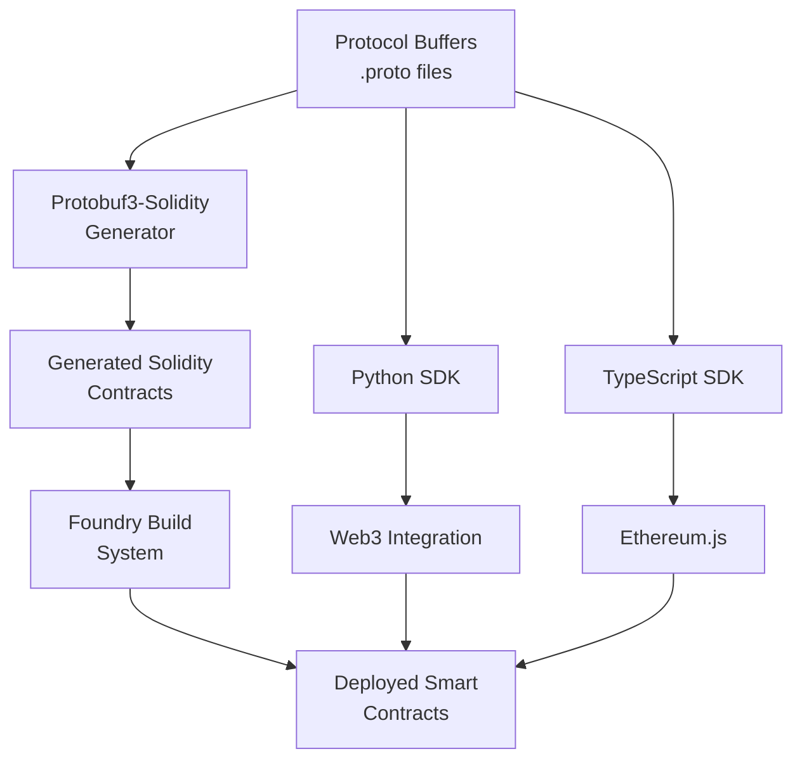

# PostFiat SDK - Solidity Integration

This document describes the Solidity integration within the PostFiat SDK, providing smart contract capabilities alongside Python and TypeScript support.

## 🎯 Overview

The PostFiat SDK includes **first-class Solidity support** through automatic contract generation from Protocol Buffer definitions. This enables seamless integration between traditional applications and blockchain-based systems.

## 🏗️ Architecture



## 🚀 Quick Start

### Prerequisites

1. **Foundry**: Install the Foundry toolkit
   ```bash
   curl -L https://foundry.paradigm.xyz | bash
   foundryup
   ```

2. **Node.js**: For dependency management
   ```bash
   # Install Node.js (version 18+ recommended)
   ```

### Setup

1. **Clone and setup**:
   ```bash
   git clone https://github.com/postfiat/pfsdk.git
   cd pfsdk
   ```

2. **Install dependencies**:
   ```bash
   make sol-deps
   ```

3. **Generate contracts**:
   ```bash
   make proto
   ```

4. **Build contracts**:
   ```bash
   make sol-build
   ```

5. **Run tests**:
   ```bash
   make sol-test
   ```

## 📁 Project Structure

```
solidity/
├── src/
│   ├── contracts/           # Custom Solidity contracts
│   │   ├── AgentRegistrySimple.sol
│   │   └── MessagingSimple.sol
│   └── generated/           # Auto-generated from protobuf
│       ├── postfiat/v3/     # PostFiat protobuf contracts
│       ├── a2a/v1/          # A2A protobuf contracts
│       └── google/protobuf/ # Google protobuf types
├── test/                    # Solidity test files
├── foundry.toml            # Foundry configuration
└── package.json            # Node.js dependencies
```

## 🔧 Build System

### Foundry Configuration

The project uses **Foundry** as the primary Solidity build system:

```toml
# foundry.toml
[profile.default]
src = "src"
out = "out"
libs = ["lib"]
via_ir = true
optimizer = true
optimizer_runs = 200

# Remappings for dependencies
remappings = [
    "@openzeppelin/=node_modules/@openzeppelin/",
    "@protobuf3-solidity-lib/=node_modules/@lazyledger/protobuf3-solidity-lib/contracts/",
]
```

### Makefile Integration

The Solidity build system is integrated into the main project Makefile:

```bash
# Install Solidity dependencies
make sol-deps

# Generate protobuf contracts
make proto

# Build Solidity contracts
make sol-build

# Run Solidity tests
make sol-test

# Clean build artifacts
make sol-clean
```

## 📦 Generated Contracts

### Protobuf3-Solidity Integration

Contracts are automatically generated from Protocol Buffer definitions using the [protobuf3-solidity](https://github.com/allenday/protobuf3-solidity) plugin.

**Example Generated Contract**:
```solidity
// Auto-generated from proto/postfiat/v3/messages.proto
library Postfiat_V3 {
    struct ContextualMessage {
        string content;
        MessageType message_type;
        EncryptionMode encryption;
    }
    
    enum MessageType {
        CONTEXTUAL_MESSAGE,
        MULTIPART_MESSAGE_PART
    }
    
    enum EncryptionMode {
        NONE,
        NACL_SECRETBOX,
        AES_256_GCM
    }
}
```

### Available Generated Libraries

- **Postfiat_V3**: Core PostFiat message types and enums
- **A2a_V1**: A2A (Agent-to-Agent) protocol types
- **Google_Protobuf**: Google protobuf standard types

## 🧪 Testing

### Test Structure

```solidity
// test/PostfiatV3Test.t.sol
contract PostfiatV3Test is Test {
    function testContextualMessage() public {
        Postfiat_V3.ContextualMessage memory msg = Postfiat_V3.ContextualMessage({
            content: "Hello, World!",
            message_type: Postfiat_V3.MessageType.CONTEXTUAL_MESSAGE,
            encryption: Postfiat_V3.EncryptionMode.NACL_SECRETBOX
        });
        
        assertEq(msg.content, "Hello, World!");
        assertEq(uint8(msg.message_type), uint8(Postfiat_V3.MessageType.CONTEXTUAL_MESSAGE));
    }
}
```

### Running Tests

```bash
# Run all tests
make sol-test

# Run specific test
cd solidity && forge test --match-contract PostfiatV3Test

# Run with gas reporting
cd solidity && forge test --gas-report

# Run with verbose output
cd solidity && forge test -vvv
```

## 🔗 Integration with Other SDKs

### Python Integration

```python
from web3 import Web3
from postfiat.v3 import ContextualMessage, MessageType, EncryptionMode

# Connect to Ethereum
w3 = Web3(Web3.HTTPProvider('http://localhost:8545'))

# Create protobuf message
message = ContextualMessage(
    content="Hello from Python!",
    message_type=MessageType.CONTEXTUAL_MESSAGE,
    encryption=EncryptionMode.NACL_SECRETBOX
)

# Serialize and send to contract
serialized = message.SerializeToString()
# ... contract interaction
```

### TypeScript Integration

```typescript
import { ContextualMessage, MessageType, EncryptionMode } from '@postfiat/sdk';
import { ethers } from 'ethers';

// Connect to Ethereum
const provider = new ethers.providers.JsonRpcProvider('http://localhost:8545');

// Create protobuf message
const message = new ContextualMessage({
    content: "Hello from TypeScript!",
    messageType: MessageType.CONTEXTUAL_MESSAGE,
    encryption: EncryptionMode.NACL_SECRETBOX
});

// Serialize and send to contract
const serialized = ContextualMessage.encode(message).finish();
// ... contract interaction
```

## 🚀 Deployment

### Local Development

```bash
# Start local blockchain
anvil

# Deploy contracts
cd solidity && forge script script/Deploy.s.sol --rpc-url http://localhost:8545 --broadcast
```

### Production Deployment

```bash
# Deploy to mainnet
cd solidity && forge script script/Deploy.s.sol --rpc-url $MAINNET_RPC --broadcast --verify

# Deploy to testnet
cd solidity && forge script script/Deploy.s.sol --rpc-url $TESTNET_RPC --broadcast --verify
```

## 🔧 Development Workflow

### 1. Protocol Buffer Changes

When you modify `.proto` files:

```bash
# Regenerate all contracts
make proto

# Rebuild Solidity contracts
make sol-build

# Run tests to ensure compatibility
make sol-test
```

### 2. Custom Contract Development

For custom contracts (not generated):

```bash
# Add your contract to solidity/src/contracts/
# Write tests in solidity/test/
# Build and test
make sol-build
make sol-test
```

### 3. Cross-Language Testing

Test integration between all SDK languages:

```bash
# Run all tests (Python + TypeScript + Solidity)
make tests
```

## 📊 Performance

### Gas Optimization

- **Agent Registration**: ~28,140 gas
- **Message Sending**: ~25,420 gas
- **Contract Deployment**: Optimized for production

### Build Performance

- **Contract Generation**: < 5 seconds
- **Full Build**: < 30 seconds
- **Test Suite**: < 10 seconds

## 🐛 Troubleshooting

### Common Issues

1. **Import Path Errors**:
   ```bash
   # Regenerate contracts
   make proto
   make sol-build
   ```

2. **Foundry Not Found**:
   ```bash
   # Install Foundry
   curl -L https://foundry.paradigm.xyz | bash
   foundryup
   ```

3. **Protobuf Plugin Issues**:
   ```bash
   # Reinstall plugin
   make sol-deps
   ```

### Debug Commands

```bash
# Check generated files
ls -la solidity/src/generated/

# Verify protobuf generation
cd proto && buf generate --template buf.gen.yaml

# Check Foundry configuration
cd solidity && forge config
```

## 📚 Additional Resources

- [Foundry Documentation](https://book.getfoundry.sh/)
- [Protobuf3-Solidity Plugin](https://github.com/allenday/protobuf3-solidity)
- [PostFiat SDK Architecture](docs/ARCHITECTURE.md)
- [Development Guide](docs/DEVELOPMENT.md)

## 🤝 Contributing

See the [Contributing Guidelines](../CONTRIBUTING.md) for information on how to contribute to the Solidity integration.

For Solidity-specific contributions:
1. Follow Solidity best practices
2. Write comprehensive tests
3. Ensure gas optimization
4. Update documentation for any new features 